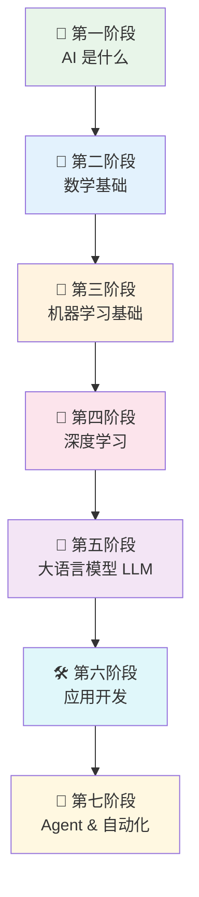
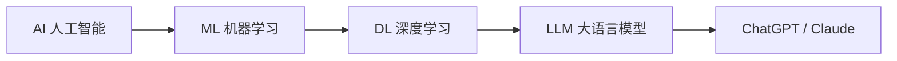
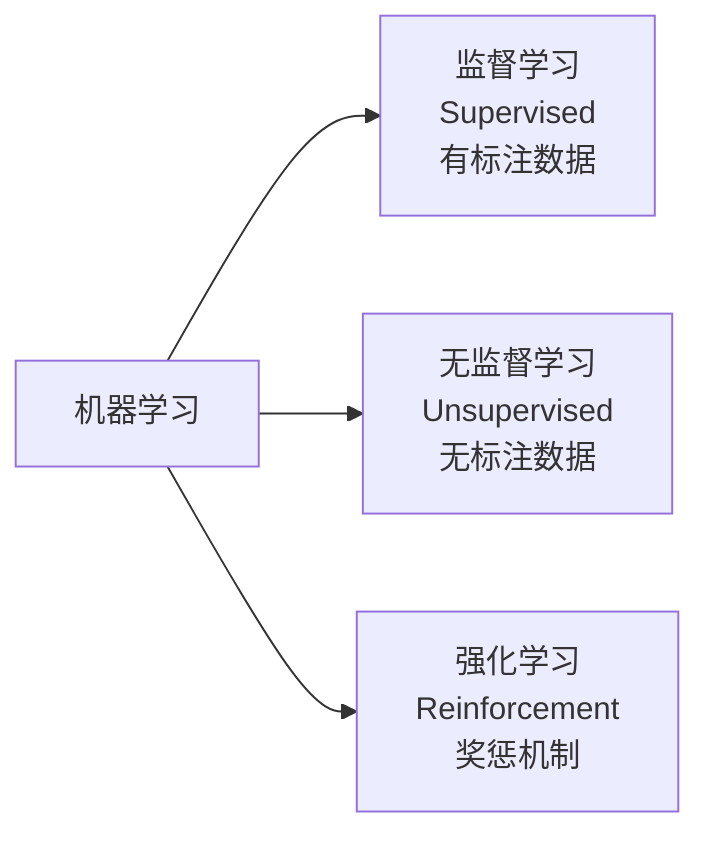
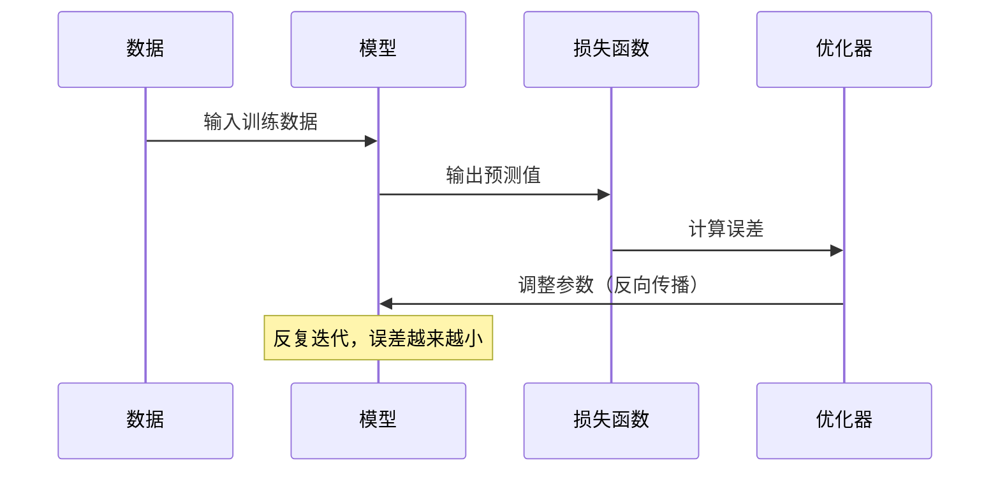
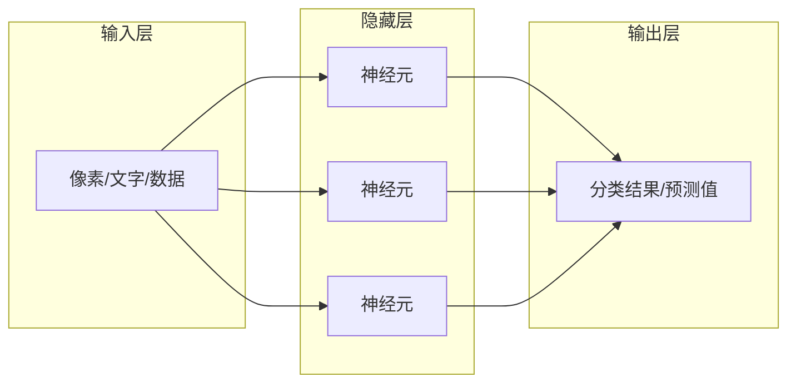
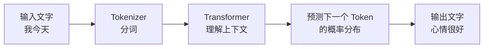
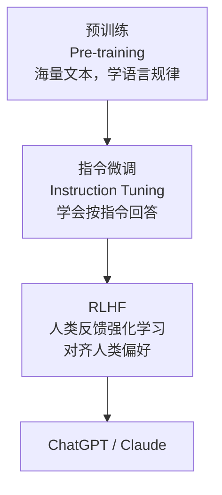
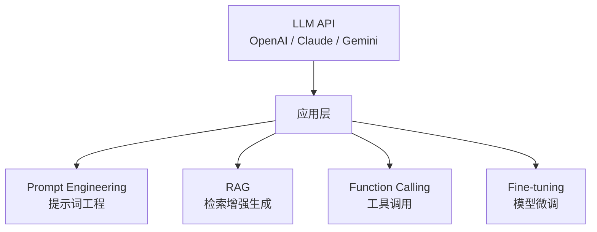
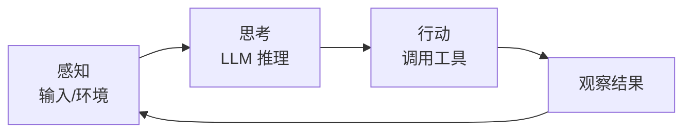

# AI 基础

> 从零开始系统学习 AI，由浅入深，循序渐进。

---

## 学习路线总览

---

## 🌱 第一阶段：AI 是什么

> 目标：建立基本认知，搞清楚 AI 能做什么、不能做什么

### 核心概念

| 概念 | 解释 |
|------|------|
| **AI（人工智能）** | 让机器模拟人类智能行为的技术总称 |
| **ML（机器学习）** | AI 的子集，让机器从数据中学习规律 |
| **DL（深度学习）** | ML 的子集，用神经网络处理复杂数据 |
| **LLM（大语言模型）** | 深度学习的应用，专注于理解和生成语言 |

### 推荐资源
- [AI 入门 - Google](https://learndigital.withgoogle.com/digitalgarage/course/fundamentals-of-digital-marketing)
- [Elements of AI（免费课程）](https://www.elementsofai.com/)

---

## 🔢 第二阶段：数学基础

> 目标：看懂 AI 论文和技术文章，不需要精通，够用就行

### 需要了解的数学

**线性代数**
- 向量（Vector）、矩阵（Matrix）
- 矩阵乘法、转置
- 特征值与特征向量
- 理解为什么重要：神经网络的本质就是矩阵运算

**微积分**
- 导数、偏导数
- 链式法则（Chain Rule）
- 理解为什么重要：神经网络训练（反向传播）依赖求导

**概率与统计**
- 概率分布（正态分布、均匀分布）
- 贝叶斯定理
- 期望、方差
- 理解为什么重要：模型输出本质上是概率分布

**推荐资源**
- [3Blue1Brown - 线性代数的本质（YouTube）](https://www.youtube.com/playlist?list=PLZHQObOWTQDPD3MizzM2xVFitgF8hE_ab)
- [3Blue1Brown - 微积分的本质](https://www.youtube.com/playlist?list=PLZHQObOWTQDMsr9K-rj53DwVRMYO3t5Yr)
- Khan Academy 数学课程

> 💡 **iOS 开发者提示**：不需要手算，理解概念即可。大部分开发场景用框架封装好的 API，数学只在读论文或调优时用到。

---

## 🤖 第三阶段：机器学习基础

> 目标：理解 AI 模型是如何训练出来的

### 核心概念

**三种学习方式**

**训练流程**

**关键术语**

| 术语 | 解释 |
|------|------|
| **训练集 / 测试集** | 训练用的数据 / 验证效果的数据 |
| **过拟合** | 模型在训练集上表现好，但泛化差 |
| **欠拟合** | 模型连训练集都学不好 |
| **超参数** | 训练前手动设置的参数（如学习率） |
| **损失函数** | 衡量预测值和真实值的差距 |
| **梯度下降** | 沿梯度方向调整参数，让损失最小 |

### 推荐资源
- [Machine Learning Crash Course - Google（免费）](https://developers.google.com/machine-learning/crash-course)
- [Andrew Ng - Machine Learning（Coursera）](https://www.coursera.org/learn/machine-learning)

---

## 🧠 第四阶段：深度学习

> 目标：理解神经网络的结构和工作原理

### 神经网络基础

### 常见网络结构

| 架构 | 全称 | 擅长领域 |
|------|------|---------|
| **CNN** | 卷积神经网络 | 图像识别、视觉 |
| **RNN / LSTM** | 循环神经网络 | 序列数据、早期 NLP |
| **Transformer** | 变换器 | 语言、图像，现代 AI 基础 |
| **GAN** | 生成对抗网络 | 图像生成 |
| **Diffusion** | 扩散模型 | 图像/视频生成（Stable Diffusion） |

### Transformer：现代 AI 的基石

> GPT、Claude、Gemini 全部基于 Transformer 架构

核心机制：**Self-Attention（自注意力）**
- 让模型理解句子中每个词与其他词的关系
- "我吃了苹果" — 模型知道"吃"的主语是"我"，宾语是"苹果"

### 推荐资源
- [3Blue1Brown - 神经网络系列](https://www.youtube.com/playlist?list=PLZHQObOWTQDNU6R1_67000Dx_ZCJB-3pi)
- [Fast.ai - Practical Deep Learning（免费）](https://course.fast.ai/)
- [Deep Learning Specialization - Andrew Ng](https://www.coursera.org/specializations/deep-learning)

---

## 💬 第五阶段：大语言模型（LLM）

> 目标：深入理解 ChatGPT / Claude 等模型的工作原理

### LLM 的本质

LLM 的核心任务只有一个：**预测下一个词**。
整个 ChatGPT 的能力，都源于对这个任务的极致优化。

### 训练过程

### 关键概念

| 概念 | 解释 |
|------|------|
| **Token** | 模型处理的基本单位，约 0.75 个英文单词 |
| **Context Window** | 上下文窗口，模型一次能"看到"的最大长度 |
| **Temperature** | 控制输出随机性，越高越有创意，越低越保守 |
| **Prompt** | 输入给模型的文字指令 |
| **Fine-tuning** | 在基础模型上用特定数据继续训练 |
| **RAG** | 检索增强生成，让模型访问外部知识库 |
| **Embedding** | 把文字转换成向量（数字），表示语义 |

### 推荐资源
- [Andrej Karpathy - Let's build GPT（YouTube）](https://www.youtube.com/watch?v=kCc8FmEb1nY)
- [Illustrated Transformer](https://jalammar.github.io/illustrated-transformer/)
- [OpenAI Cookbook](https://cookbook.openai.com/)

---

## 🛠 第六阶段：应用开发

> 目标：用 LLM API 构建实际应用

### 技术栈

### Prompt Engineering 基础

好的 Prompt 要素：
1. **角色设定** — "你是一个 iOS 开发专家"
2. **明确任务** — "帮我 review 这段 Swift 代码"
3. **提供上下文** — 贴上代码
4. **指定输出格式** — "用 Markdown 列出问题和建议"

### iOS 开发结合点

| 场景 | 技术 |
|------|------|
| App 内 AI 对话功能 | OpenAI API / Claude API |
| 本地运行小模型 | Core ML + 量化模型 |
| 语音转文字 | Whisper API |
| 图像识别 | Vision Framework / GPT-4V |
| 代码自动补全 | GitHub Copilot API |

### 推荐资源
- [OpenAI API 文档](https://platform.openai.com/docs)
- [Anthropic Claude API 文档](https://docs.anthropic.com)
- [LangChain 文档](https://python.langchain.com/)
- [苹果 Core ML 文档](https://developer.apple.com/documentation/coreml)

---

## 🚀 第七阶段：Agent & 自动化

> 目标：构建能自主完成多步任务的 AI Agent

### 什么是 Agent？

普通 LLM = 问答机器
Agent = **能感知 → 思考 → 行动 → 循环** 的自主系统

### Agent 核心能力

| 能力 | 说明 |
|------|------|
| **Tool Use** | 调用外部工具（搜索、代码执行、API） |
| **Memory** | 记忆历史对话和上下文 |
| **Planning** | 把复杂任务拆分成多步执行 |
| **Multi-Agent** | 多个 Agent 协作完成任务 |

### 推荐资源
- [LangGraph 文档](https://langchain-ai.github.io/langgraph/)
- [AutoGPT](https://github.com/Significant-Gravitas/AutoGPT)
- [OpenClaw](https://docs.openclaw.ai) — 你正在用的本地 Agent 框架

---

## 📚 综合学习资源

### 免费课程
| 课程 | 平台 | 难度 |
|------|------|------|
| [Elements of AI](https://www.elementsofai.com/) | 独立 | ⭐ 入门 |
| [ML Crash Course](https://developers.google.com/machine-learning/crash-course) | Google | ⭐⭐ 初级 |
| [Fast.ai](https://course.fast.ai/) | 独立 | ⭐⭐ 初级 |
| [CS229 - Stanford](https://cs229.stanford.edu/) | Stanford | ⭐⭐⭐ 中级 |
| [CS224N - NLP](https://web.stanford.edu/class/cs224n/) | Stanford | ⭐⭐⭐⭐ 高级 |

### 必读论文（按重要性）
1. **Attention Is All You Need**（2017）— Transformer 原始论文
2. **BERT**（2018）— 双向语言模型
3. **GPT-3**（2020）— 大规模语言模型
4. **InstructGPT**（2022）— RLHF 训练方法

### 中文资源
- [李沐 - 动手学深度学习](https://zh.d2l.ai/)
- [李宏毅机器学习课程（YouTube）](https://www.youtube.com/@HungyiLeeNTU)

---

> 💡 **学习建议：** 不需要从头到尾全学完再动手。边学边做效果最好 — 第三阶段后就可以开始用 API 写小项目了。
