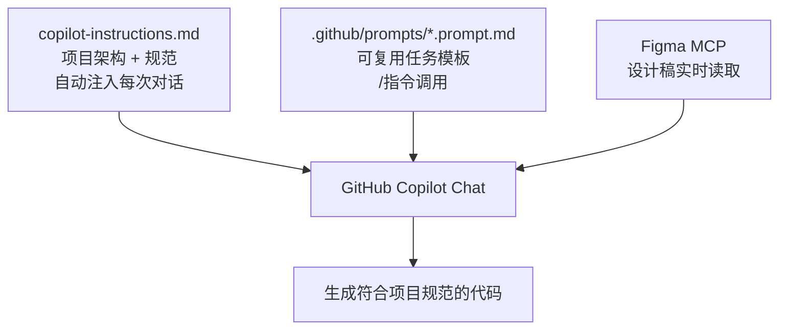
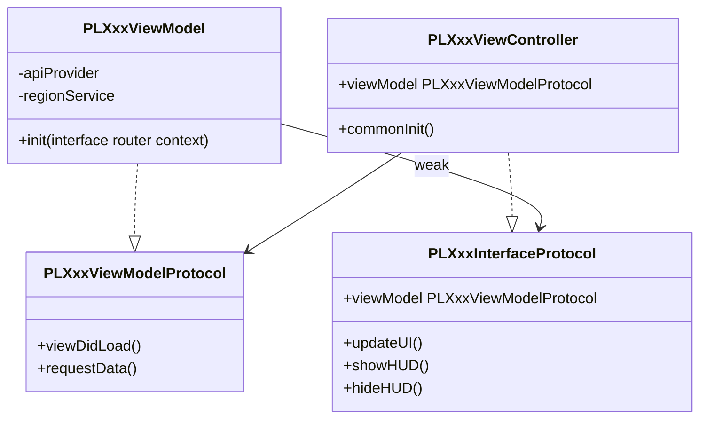
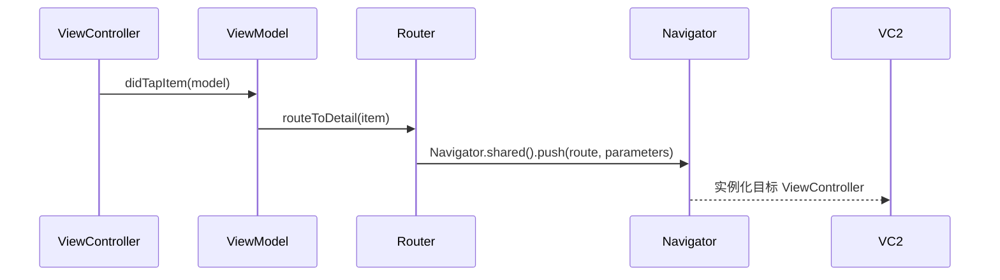
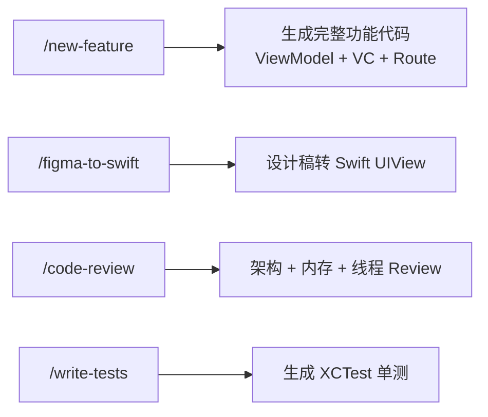
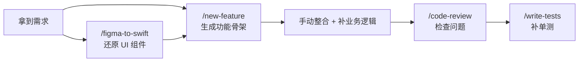
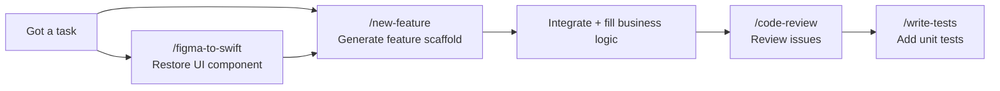

# VS Code + GitHub Copilot iOS 高效开发工作流

> 本文记录如何为 Coins iOS 项目配置 GitHub Copilot，让 AI 自动理解项目架构规范，做到零重复输入上下文、开口即出符合规范的代码。

## 核心思路

Copilot 生成代码质量低的根本原因是**它不了解你的项目**。每次开口都要说"我们用 MVVM、要用 PL 前缀、颜色用 CoinsColors..."，累且不稳定。

解决方案是建立一套**上下文注入体系**，让规范自动流入每次对话：



---

## 三层架构

| 层级 | 文件位置 | 作用 | 调用方式 |
|------|---------|------|---------|
| **全局规范** | `.github/copilot-instructions.md` | 架构、命名、组件规范 | 自动注入，无需手动引用 |
| **任务模板** | `.github/prompts/*.prompt.md` | 新功能、Review、测试 | Chat 输入 `/模板名` |
| **设计稿** | Figma MCP | 实时读取颜色、组件、标注 | 直接粘贴 Figma 链接 |

---

## copilot-instructions.md 写什么

这是整个方案的核心文件。放在项目 `.github/` 目录下，Copilot 会**自动读取**，不需要每次手动 `@` 引用。

写进去的不是通用规范，是**从项目真实代码里提炼的**：

### 1. 模块双层结构

```
XxxModule/          ← 实现层（ViewController、ViewModel、API、UI）
XxxModuleService/   ← 接口层（Routes、Protocol、共享 Model）
```

实现层不可直接 import 另一个模块实现层，跨模块通信走 ModuleService 层。

### 2. MVVM 三件套

每个页面由三个协议/类组成：



### 3. Navigator 路由系统

URL-based 路由，路径定义在 ModuleService 层：

```swift
// ModuleService 层：路径常量
public class PLXxxModuleRoutes: NSObject {
    static let detail = "/pl/xxx/detail"
}

// ViewModel 层：通过 RouterProtocol 调用
router?.routeToDetail(item: model)

// Router 实现层：调用 Navigator
Navigator.shared().push(PLXxxModuleRoutes.detail, parameters: [
    PLXxxModuleConstants.idKey: item.id
])
```



---

## ViewController / UIView 标准结构

项目统一使用三段式初始化，**不用** `setupUI()` 这种混合写法：

```swift
class PLXxxViewController: PLCoinsAppRevampScrollViewController {
    var viewModel: PLXxxViewModelProtocol!

    override func viewDidLoad() {
        super.viewDidLoad()
        commonInit()
    }
}

private extension PLXxxViewController {
    func commonInit() {
        constructUI()   // addSubview
        layoutUI()      // SnapKit 约束
        configureUI()   // 样式、初始状态
    }
}
```

自定义 UIView 同理：

```swift
class PLXxxView: UIView {
    init(/* 参数 */) {
        super.init(frame: .zero)
        commonInit()
    }
}

private extension PLXxxView {
    func commonInit() {
        constructUI()
        layoutUI()
        configureUI()
    }
}
```

---

## 依赖注入

工程中有两种写法，按同模块现有风格选一种：

**方式一：Dependency 对象（Class）**
```swift
final class PLXxxViewModelDependency: NSObject {
    var apiProvider: PLCoinsAPIProviderProtocol?
    var regionService: RegionService?
}
```

**方式二：InputContext 结构体**
```swift
struct PLXxxInputContext {
    let currency: String
    let listType: PLXxxListType
}
```

Service 也可以通过 Octopus 在 ViewModel 内部懒加载：
```swift
private lazy var someService = Octopus.applicationContext?.getSucker(type: PLSomeService.self)
```

---

## Prompt 模板体系

放在 `.github/prompts/` 下，在 VS Code Copilot Chat 里用 `/` 调用。



### /new-feature 典型使用流程

```
1. 让 Figma MCP 读设计稿
   → "读取这个 Figma 链接，总结颜色/组件/交互"

2. 调用模板
   /new-feature
   功能名称：QuickPay 上限修改
   PRD：用户可以修改 QuickPay 单笔上限，范围 100~50000
   Figma 设计信息：[Step 1 的输出]

3. Copilot 直接输出：
   - PLQuickPayLimitModuleRoutes.swift
   - PLQuickPayLimitViewModel.swift（含 Protocol + Dependency）
   - PLQuickPayLimitViewController.swift（三段式结构）
   - PLQuickPayLimitAPI.swift
```

---

## 落地步骤

### 第一步：复制配置文件

```bash
cp -r ~/.openclaw/workspace/coins-copilot/.github /path/to/Coins/
```

确认路径正确：
```bash
ls /path/to/Coins/.github/copilot-instructions.md
```

### 第二步：在 VS Code 里打开项目

用 VS Code **打开 Coins 项目根目录**（`File → Open Folder`），不是打开某个子目录。
`copilot-instructions.md` 是**静默生效**的，没有弹窗提示，不需要任何手动操作。

### 第三步：验证是否生效

在 Copilot Chat 输入：
```
What coding conventions should I follow in this project?
```

✅ 已生效：回答里提到 `PL` 前缀、`PLCoinsAppRevampScrollViewController`、`commonInit` 三段式、`Navigator.shared().push` 等项目特定内容

❌ 未生效：回答的是通用 Swift 规范，没有项目特定内容 → 检查文件路径是否正确

### 第四步：测试多文件生成

验证生效后，测试生成完整功能代码时**必须明确列出需要哪些文件**，否则 Copilot 只会输出一个文件：

```
参考项目规范，帮我实现"用户余额展示"功能，输出以下文件：

1. PLUserBalanceViewModel.swift
   - 含 PLUserBalanceInterfaceProtocol、PLUserBalanceViewModelProtocol
   - 含 PLUserBalanceInputContext（结构体，传入 currency: String）
   - 含 PLUserBalanceViewModel 实现

2. PLUserBalanceViewController.swift
   - 继承 PLCoinsAppRevampScrollViewController
   - commonInit / constructUI / layoutUI / configureUI 三段式
   - 遵守 PLUserBalanceInterfaceProtocol

3. PLUserBalanceRouterProtocol.swift
   - 包含 routeToTransactionDetail() 方法
```

> 或者直接使用 `/new-feature` 模板，它已经把文件列表写好了，填入 PRD 和设计信息即可。

---

## 实战：四个模板如何配合使用

### 完整开发流程



---

### Step 1：`/new-feature` — 生成功能骨架

在 Copilot Chat 输入 `/new-feature`，然后填入变量：

```
/new-feature

功能名称：QuickPay 上限修改

PRD：
用户可以在设置页修改 QuickPay 单笔支付上限。
上限范围 100~50000 PHP，默认 5000。
修改后需要调用接口保存，保存成功 toast 提示，失败弹错误。

Figma 设计稿链接：https://figma.com/xxx
（可附加简单说明，如特殊交互逻辑、需注意的边界状态）

需要的 Services：
apiProvider、regionService
```

**这一步输出：** ViewModel + ViewController + RouterProtocol + API 定义，是整个功能的骨架。

> ⚠️ 必须明确列出需要哪些文件，否则 Copilot 只会输出一个文件。`/new-feature` 模板里已经写好了文件清单。

---

### Step 2：`/figma-to-swift` — 还原复杂 UI 组件（可选）

如果某个 View 比较复杂，想单独生成，用这个模板：

```
/figma-to-swift

组件名称：QuickPayLimitInputView

Figma 设计稿链接：https://figma.com/xxx
（可附加简单说明，如特殊交互逻辑、需注意的边界状态）

交互说明：
- 输入非数字自动过滤
- 超出范围时输入框变红，提示文字变红
```

输出是一个标准三段式 `PLQuickPayLimitInputView`，直接放进 Step 1 生成的 ViewController 里。

> 大部分情况 Step 2 可以跳过，`/new-feature` 生成的 VC 里已有基础 UI 结构，只有设计稿特别复杂的 View 才单独跑 `/figma-to-swift`。

---

### Step 3：`/code-review` — 写完后 Review

升级后的 code-review 支持三种使用方式，不需要手动粘贴代码：

**方式一：review 本次所有改动（最常用）**
```
/code-review
#changes
```

**方式二：review 指定文件**
```
/code-review
#PLXxxViewModel.swift #PLXxxViewController.swift
```

**方式三：对照 PRD review 业务逻辑**
```
/code-review
#changes
#quickpay-limit.md
```

**方式四：GitLab MR review（无原生支持，用 git diff 绕过）**
```bash
# 终端拿到 diff
git fetch origin && git diff origin/main...HEAD
```
```
/code-review
[粘贴 diff 输出]
对照以下 PRD 检查业务逻辑：[粘贴 PRD 描述]
```

**输出三个级别：**
- 🔴 必须改（架构问题、内存安全、线程安全）
- 🟡 建议改（代码质量、可维护性）
- 🟢 值得保留的亮点

> `#changes` 是 VS Code Copilot 内置变量，直接引用当前 git diff，不需要任何额外操作。

---

### Step 4：`/write-tests` — 功能稳定后补单测

在 Copilot Chat 输入 `/write-tests`，然后用 `#` 引用文件（输入 `#` 后系统会弹出文件提示，回车确认后自动变成 `#file:PLXxxViewModel.swift` 的形式）：

```
/write-tests
#PLQuickPayLimitViewModel.swift

需要重点测试的场景：
保存成功、保存失败、输入超出范围
```

**输出：** `PLQuickPayLimitViewModelTests.swift` + `PLQuickPayLimitMocks.swift`

---

### 一次完整开发的操作顺序

```
1. /new-feature      → 生成功能骨架（ViewModel + VC + Router + API）
2. /figma-to-swift   → 生成复杂 UI 组件（如有）
3. 手动把两者整合，补业务逻辑
4. /code-review      → 检查问题，修掉 🔴
5. /write-tests      → 补单测
```

---

## 关键规范速查

| 场景 | 规范 |
|------|------|
| 类/协议/枚举命名 | 必须加 `PL` 前缀 |
| 颜色 | `CoinsColors.xxx`，禁止硬编码 |
| 字体 | `CoinsFonts.xxx`，禁止 `UIFont.systemFont` |
| 字符串 | `coinsLocalizedString("Key.Path")`，禁止硬编码 |
| 按钮 | `CoinsButton` / `CoinsV2UIButton` |
| 闭包中 self | `[weak self]` + guard let |
| 错误处理 | `ErrorHandlerHelper.presentError(...)` |
| 路由路径格式 | `/pl/模块名/页面名`（全小写） |
| VC 基类 | `PLCoinsAppRevampScrollViewController` |
| VC 初始化 | `commonInit()` → `constructUI/layoutUI/configureUI` |

---

## 注意事项

1. **`copilot-instructions.md` 有字符数限制**（约 8000 字），写规范时只保留高频、易错的内容
2. **Prompt 模板用 `{{变量}}` 占位**，调用时替换为实际内容
3. **Figma MCP 需要在 VS Code 设置里配置好**，配置完成后直接粘贴链接即可
4. **工程中写法不完全统一**（如依赖注入有两种），Copilot 生成后仍需对照同模块已有代码确认风格

---

## English Reference

> Same workflow, condensed for quick reference.

### Overview

The root cause of poor Copilot output is that **it doesn't know your project**. The solution is a three-layer context injection system:

| Layer | File | Purpose | How it's loaded |
|-------|------|---------|-----------------|
| **Global rules** | `.github/copilot-instructions.md` | Architecture, naming, component conventions | Auto-injected into every Copilot conversation |
| **Task templates** | `.github/prompts/*.prompt.md` | New feature, code review, tests | Type `/template-name` in Copilot Chat |
| **Design specs** | Figma MCP | Live colors, components, spacing | Paste Figma link directly |

### Architecture Layers

```
PLXxxModule (Octopus Module)     ← Business domain entry point
  └── FlowRouter (N per module)  ← Manages one complete user flow
        └── Router               ← Single-page navigation + pop notification
              ├── ViewController ← UI only
              └── ViewModel      ← Business logic
```

### MVVM+R — 4 Files Per Screen

| File | Role |
|------|------|
| `PLXxxBuilder.swift` | Assembles VC + VM + Router, returns RouterProtocol |
| `PLXxxRouter.swift` | RouterProtocol (outward) + RouterInputProtocol (for ViewModel) |
| `PLXxxViewController.swift` | Inherits `PLCoinsUIViewController`; 3-stage `commonInit` |
| `PLXxxViewModel.swift` | Business logic; holds `interface` and `router` as `weak` |

### 3-Stage UI Init (VC and UIView)

```swift
func commonInit() {
    constructUI()   // addSubview
    layoutUI()      // SnapKit constraints
    configureUI()   // static styles (called once)
    updateUI()      // dynamic data (may be called multiple times)
}
```

### Pop Release Chain (required)

```
viewControllerDidPop()
  → viewModel.didPop()
    → router.didPop()
      → delegate.routerDidClose()
        → flowRouter.stepRouter = nil   // releases VC
```

### Module Rules

- `onMounted`: call `PLRootRouterHolderHelper.attach(holder: self)`
- Implement `cleanupRouters()` — nil out every FlowRouter/Router
- One `registerXxxRoute()` private function per route
- One `extension PLXxxModule: PLYyyDelegate` per FlowRouter delegate

### Route Handler Patterns

```swift
// Pattern 1: FlowRouter flow
func registerXxxRoute() {
    Navigator.shared().registerRoute(PLXxxModuleRoutes.xxx) { [weak self] option in
        guard let self, let ctx = option.parameters?[key] as? PLXxxContext else { return }
        xxxFlowRouter = PLXxxFlowBuilder.defaultBuilder().build()
        xxxFlowRouter?.delegate = self
        xxxFlowRouter?.push(context: ctx)
    }
}

// Pattern 2: Direct jump (simple screen)
func registerYyyRoute() {
    Navigator.shared().registerRoute(PLXxxModuleRoutes.yyy) { option in
        var vc: UIViewController = PLYyyBuilder.defaultBuilder().build()
        if option.isModal {
            vc = Navigator.shared().buildDefaultNavigationController(rootViewController: vc)
        }
        Navigator.shared().doJump(option: option, viewController: vc)
    }
}
```

### Prompt Templates Workflow



### Step 1: `/new-feature` — Generate the Feature Scaffold

Start every new feature here. In Copilot Chat, type `/new-feature` and fill in the variables:

```
/new-feature

Feature name: QuickPay Limit Setting

PRD:
Users can modify the single-transaction limit for QuickPay.
Valid range: 100–50,000 PHP. Default: 5,000.
On save: call the API, show toast on success, show error dialog on failure.

Figma URL: https://figma.com/xxx
(Add brief notes if needed, e.g. edge cases or special interactions)

Required services: apiProvider, regionService
```

**Output:** `PLXxxBuilder.swift`, `PLXxxRouter.swift`, `PLXxxViewModel.swift`, `PLXxxViewController.swift`, `PLXxxAPI.swift` — the complete feature scaffold.

> ⚠️ The template already lists the required files. Don't skip any — Copilot will only generate one file if you don't specify.

---

### Step 2: `/figma-to-swift` — Restore Complex UI Components (optional)

Use this when a specific View is too complex to generate inline, or when you want to build the UI layer first independently.

```
/figma-to-swift

Component name: QuickPayLimitInputView

Figma URL: https://figma.com/xxx
(Add brief notes if needed, e.g. edge cases or special interactions)

Interaction notes:
- Filter out non-numeric input automatically
- Turn input box red when value is out of range
- Show red helper text: "Range: 100 – 50,000 PHP"
```

**Output:** A standalone `PLQuickPayLimitInputView` with full 3-stage `commonInit`, SnapKit constraints, and a clean data-binding interface. Drop it directly into the ViewController from Step 1.

> Most of the time you can skip this step — `/new-feature` already generates basic UI structure. Only use `/figma-to-swift` for designs that are too complex to describe inline.

---

### Step 3: `/code-review` — Review After Writing

Four usage patterns — no need to paste code manually:

**Most common: review all current changes**
```
/code-review
#changes
```

**Review specific files**
```
/code-review
#PLXxxViewModel.swift #PLXxxViewController.swift
```

**Review against PRD (business logic check)**
```
/code-review
#changes
#quickpay-limit.md
```

**GitLab MR review (workaround — no native support)**
```bash
# Get the diff first
git fetch origin && git diff origin/main...HEAD
```
```
/code-review
[paste diff output here]
Check business logic against: [paste PRD description]
```

**Output severity levels:**
- 🔴 Must fix (architecture, memory safety, thread safety)
- 🟡 Suggested (code quality, maintainability)
- 🟢 Worth keeping (good patterns spotted)

> `#changes` is a built-in VS Code Copilot variable — it references the current `git diff` automatically.

---

### Step 4: `/write-tests` — Add Unit Tests After Feature Stabilizes

```
/write-tests
#PLQuickPayLimitViewModel.swift

Key scenarios to cover:
- Save success
- Save failure (API error)
- Input out of range
- Input is empty
```

**Output:** `PLQuickPayLimitViewModelTests.swift` + `PLQuickPayLimitMocks.swift`

> ViewModels are fully testable via protocol mocks. Services obtained via `Octopus.getSucker` will be `nil` in test context — inject them via `init` or set up Octopus before tests.

---

### Full Development Order

```
1. /new-feature      → scaffold (ViewModel + VC + Router + API)
2. /figma-to-swift   → complex UI components (if needed)
3. Manually integrate, fill business logic
4. /code-review      → fix all 🔴 issues
5. /write-tests      → unit tests
```

### Quick Reference

| Concern | Rule |
|---------|------|
| Naming | `PL` prefix on all classes/protocols/enums |
| Colors (legacy) | `CoinsColors.xxx` |
| Colors (new components) | `CoinsColorSet.sceneColorSet.xxx` |
| Fonts | `CoinsFonts.xxx` — no `UIFont.systemFont` |
| Display strings | `coinsLocalizedString("Key.Path")` |
| Server-bound values | Plain string constants, no localization |
| Buttons | `CoinsButton` / `CoinsV2UIButton` |
| Weak self in closures | `[weak self]` + `guard let self` |
| Error handling | `ErrorHandlerHelper.presentError(...)` |
| Route path format | `/pl/module-name/page-name` (lowercase) |
| VC base class | `PLCoinsUIViewController` (scroll: `PLCoinsAppRevampScrollViewController`) |
| Threading | Framework handles main thread — no `DispatchQueue.main` needed |

---

## 如何同步到 Confluence

Confluence 是内网，无法自动推送。以下是从低成本到高质量的几种方案：

### 方案 A：Markdown 直接导入（最快，5 分钟）

Confluence 编辑器内置 Markdown 导入：

1. 打开 Confluence，新建或编辑页面
2. 点击编辑器右上角 `···` → **Insert Markdown**
3. 把 `copilot-workflow.md` 内容整个粘贴进去
4. 确认，Confluence 自动转换为富文本

**缺点**：mermaid 流程图会变成代码块，需要手动替换为截图。

---

### 方案 B：文字 + 截图（推荐，效果最好）

1. 在本地浏览器打开 `https://ildream.github.io/learnAI/ios/copilot-workflow.html`
2. 对每个 mermaid 图截图保存
3. Confluence 用方案 A 导入文字
4. 找到图表位置，删掉代码块，插入截图

---

### 方案 C：Confluence Markdown 插件（一劳永逸）

如果公司 Confluence 装了 **Markdown Macro** 插件：

1. 编辑页面 → `插入宏` → 搜索 `Markdown`
2. 把 `.md` 文件内容粘贴到宏的代码框里
3. 保存后实时渲染（每次更新只需改宏内容）

---

### 方案 D：Draw.io 重绘流程图（最清晰）

如果公司装了 **Draw.io / Diagrams** 插件，把 mermaid 图用 Draw.io 重画一遍，比截图更清晰且可编辑。

---

### 推荐做法

**短期**：方案 A + B 组合 — 文字用 Markdown 导入，图表截图替换，20 分钟搞定。

**长期**：问一下公司有没有 Markdown Macro 或 Draw.io 插件，有的话方案 C 最省力，后续更新只需改一个地方。

