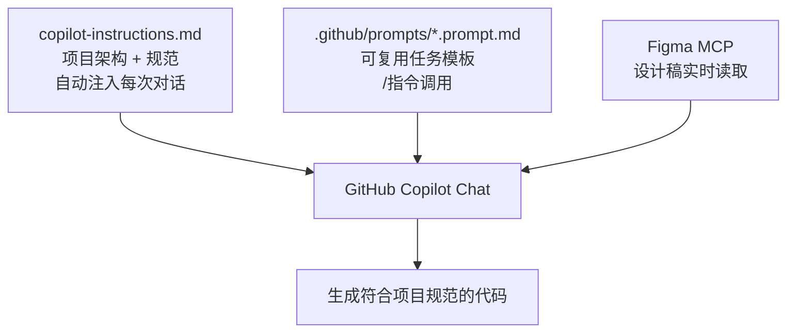
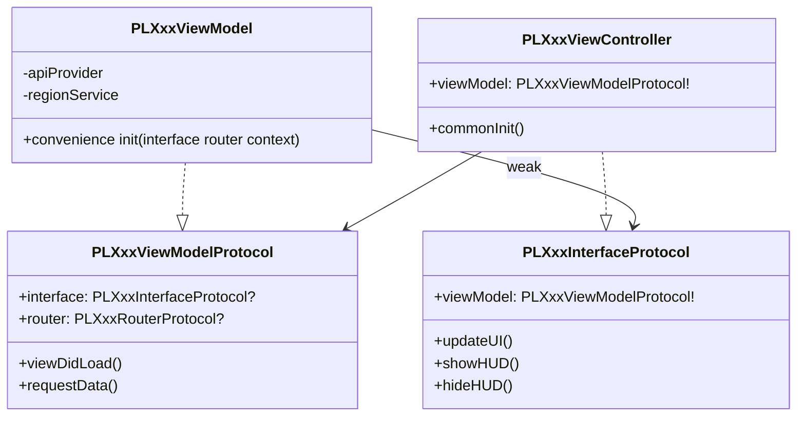
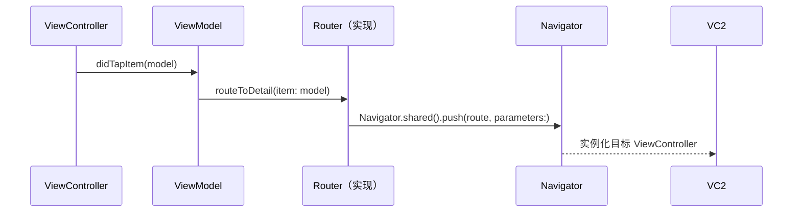

# VS Code + GitHub Copilot iOS 高效开发工作流

> 本文记录如何为 Coins iOS 项目配置 GitHub Copilot，让 AI 自动理解项目架构规范，做到零重复输入上下文、开口即出符合规范的代码。

## 核心思路

Copilot 生成代码质量低的根本原因是**它不了解你的项目**。每次开口都要说"我们用 MVVM、要用 PL 前缀、颜色用 CoinsColors..."，累且不稳定。

解决方案是建立一套**上下文注入体系**，让规范自动流入每次对话：



---

## 三层架构

| 层级 | 文件位置 | 作用 | 调用方式 |
|------|---------|------|---------|
| **全局规范** | `.github/copilot-instructions.md` | 架构、命名、组件规范 | 自动注入，无需手动引用 |
| **任务模板** | `.github/prompts/*.prompt.md` | 新功能、Review、测试 | Chat 输入 `/模板名` |
| **设计稿** | Figma MCP | 实时读取颜色、组件、标注 | 直接粘贴 Figma 链接 |

---

## copilot-instructions.md 写什么

这是整个方案的核心文件。放在项目 `.github/` 目录下，Copilot 会**自动读取**，不需要每次手动 `@` 引用。

写进去的不是通用规范，是**从项目真实代码里提炼的**：

### 1. 模块双层结构

```
XxxModule/          ← 实现层（ViewController、ViewModel、API、UI）
XxxModuleService/   ← 接口层（Routes、Protocol、共享 Model）
```

实现层不可直接 import 另一个模块实现层，跨模块通信走 ModuleService 层。

### 2. MVVM 三件套

每个页面由三个协议/类组成：



### 3. Navigator 路由系统

URL-based 路由，路径定义在 ModuleService 层：

```swift
// ModuleService 层：路径常量
public class PLXxxModuleRoutes: NSObject {
    static let detail = "/pl/xxx/detail"
}

// ViewModel 层：通过 RouterProtocol 调用
router?.routeToDetail(item: model)

// Router 实现层：调用 Navigator
Navigator.shared().push(PLXxxModuleRoutes.detail, parameters: [
    PLXxxModuleConstants.idKey: item.id
])
```



---

## ViewController / UIView 标准结构

项目统一使用三段式初始化，**不用** `setupUI()` 这种混合写法：

```swift
class PLXxxViewController: PLCoinsAppRevampScrollViewController {
    var viewModel: PLXxxViewModelProtocol!

    override func viewDidLoad() {
        super.viewDidLoad()
        commonInit()
    }
}

private extension PLXxxViewController {
    func commonInit() {
        constructUI()   // addSubview
        layoutUI()      // SnapKit 约束
        configureUI()   // 样式、初始状态
    }
}
```

自定义 UIView 同理：

```swift
class PLXxxView: UIView {
    init(/* 参数 */) {
        super.init(frame: .zero)
        commonInit()
    }
}

private extension PLXxxView {
    func commonInit() {
        constructUI()
        layoutUI()
        configureUI()
    }
}
```

---

## 依赖注入

工程中有两种写法，按同模块现有风格选一种：

**方式一：Dependency 对象（Class）**
```swift
final class PLXxxViewModelDependency: NSObject {
    var apiProvider: PLCoinsAPIProviderProtocol?
    var regionService: RegionService?
}
```

**方式二：InputContext 结构体**
```swift
struct PLXxxInputContext {
    let currency: String
    let listType: PLXxxListType
}
```

Service 也可以通过 Octopus 在 ViewModel 内部懒加载：
```swift
private lazy var someService = Octopus.applicationContext?.getSucker(type: PLSomeService.self)
```

---

## Prompt 模板体系

放在 `.github/prompts/` 下，在 VS Code Copilot Chat 里用 `/` 调用。

```mermaid
graph LR
    A[/new-feature] --> B[生成完整功能代码\nViewModel + VC + Route]
    C[/figma-to-swift] --> D[设计稿转 Swift UIView]
    E[/code-review] --> F[架构 + 内存 + 线程 Review]
    G[/write-tests] --> H[生成 XCTest 单测]
```

### /new-feature 典型使用流程

```
1. 让 Figma MCP 读设计稿
   → "读取这个 Figma 链接，总结颜色/组件/交互"

2. 调用模板
   /new-feature
   功能名称：QuickPay 上限修改
   PRD：用户可以修改 QuickPay 单笔上限，范围 100~50000
   Figma 设计信息：[Step 1 的输出]

3. Copilot 直接输出：
   - PLQuickPayLimitModuleRoutes.swift
   - PLQuickPayLimitViewModel.swift（含 Protocol + Dependency）
   - PLQuickPayLimitViewController.swift（三段式结构）
   - PLQuickPayLimitAPI.swift
```

---

## 落地步骤

```bash
# 1. 把 .github 目录放到项目根目录
cp -r coins-copilot/.github /path/to/Coins/

# 2. 重启 VS Code，Copilot Chat 会自动读取 copilot-instructions.md

# 3. 验证生效
# 在 Chat 输入：
# "帮我写一个简单的 ViewModel 骨架，功能是展示用户余额"
# 看生成结果是否有 PL 前缀、PLCoinsAppRevampScrollViewController 基类、三段式结构
```

---

## 关键规范速查

| 场景 | 规范 |
|------|------|
| 类/协议/枚举命名 | 必须加 `PL` 前缀 |
| 颜色 | `CoinsColors.xxx`，禁止硬编码 |
| 字体 | `CoinsFonts.xxx`，禁止 `UIFont.systemFont` |
| 字符串 | `coinsLocalizedString("Key.Path")`，禁止硬编码 |
| 按钮 | `CoinsButton` / `CoinsV2UIButton` |
| 闭包中 self | `[weak self]` + guard let |
| 错误处理 | `ErrorHandlerHelper.presentError(...)` |
| 路由路径格式 | `/pl/模块名/页面名`（全小写） |
| VC 基类 | `PLCoinsAppRevampScrollViewController` |
| VC 初始化 | `commonInit()` → `constructUI/layoutUI/configureUI` |

---

## 注意事项

1. **`copilot-instructions.md` 有字符数限制**（约 8000 字），写规范时只保留高频、易错的内容
2. **Prompt 模板用 `{{变量}}` 占位**，调用时替换为实际内容
3. **Figma MCP 需要在 VS Code 设置里配置好**，配置完成后直接粘贴链接即可
4. **工程中写法不完全统一**（如依赖注入有两种），Copilot 生成后仍需对照同模块已有代码确认风格
