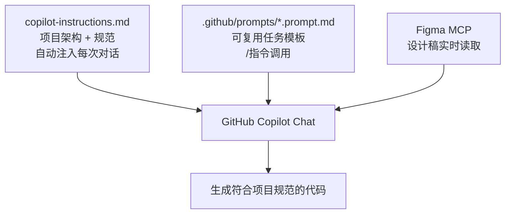
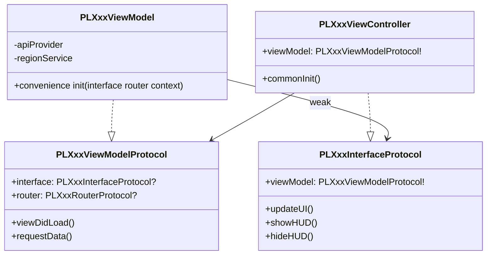
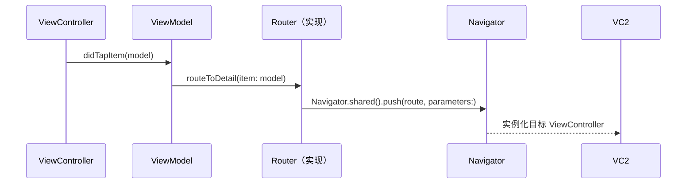

# VS Code + GitHub Copilot iOS 高效开发工作流

> 本文记录如何为 Coins iOS 项目配置 GitHub Copilot，让 AI 自动理解项目架构规范，做到零重复输入上下文、开口即出符合规范的代码。

## 核心思路

Copilot 生成代码质量低的根本原因是**它不了解你的项目**。每次开口都要说"我们用 MVVM、要用 PL 前缀、颜色用 CoinsColors..."，累且不稳定。

解决方案是建立一套**上下文注入体系**，让规范自动流入每次对话：



---

## 三层架构

| 层级 | 文件位置 | 作用 | 调用方式 |
|------|---------|------|---------|
| **全局规范** | `.github/copilot-instructions.md` | 架构、命名、组件规范 | 自动注入，无需手动引用 |
| **任务模板** | `.github/prompts/*.prompt.md` | 新功能、Review、测试 | Chat 输入 `/模板名` |
| **设计稿** | Figma MCP | 实时读取颜色、组件、标注 | 直接粘贴 Figma 链接 |

---

## copilot-instructions.md 写什么

这是整个方案的核心文件。放在项目 `.github/` 目录下，Copilot 会**自动读取**，不需要每次手动 `@` 引用。

写进去的不是通用规范，是**从项目真实代码里提炼的**：

### 1. 模块双层结构

```
XxxModule/          ← 实现层（ViewController、ViewModel、API、UI）
XxxModuleService/   ← 接口层（Routes、Protocol、共享 Model）
```

实现层不可直接 import 另一个模块实现层，跨模块通信走 ModuleService 层。

### 2. MVVM 三件套

每个页面由三个协议/类组成：



### 3. Navigator 路由系统

URL-based 路由，路径定义在 ModuleService 层：

```swift
// ModuleService 层：路径常量
public class PLXxxModuleRoutes: NSObject {
    static let detail = "/pl/xxx/detail"
}

// ViewModel 层：通过 RouterProtocol 调用
router?.routeToDetail(item: model)

// Router 实现层：调用 Navigator
Navigator.shared().push(PLXxxModuleRoutes.detail, parameters: [
    PLXxxModuleConstants.idKey: item.id
])
```



---

## ViewController / UIView 标准结构

项目统一使用三段式初始化，**不用** `setupUI()` 这种混合写法：

```swift
class PLXxxViewController: PLCoinsAppRevampScrollViewController {
    var viewModel: PLXxxViewModelProtocol!

    override func viewDidLoad() {
        super.viewDidLoad()
        commonInit()
    }
}

private extension PLXxxViewController {
    func commonInit() {
        constructUI()   // addSubview
        layoutUI()      // SnapKit 约束
        configureUI()   // 样式、初始状态
    }
}
```

自定义 UIView 同理：

```swift
class PLXxxView: UIView {
    init(/* 参数 */) {
        super.init(frame: .zero)
        commonInit()
    }
}

private extension PLXxxView {
    func commonInit() {
        constructUI()
        layoutUI()
        configureUI()
    }
}
```

---

## 依赖注入

工程中有两种写法，按同模块现有风格选一种：

**方式一：Dependency 对象（Class）**
```swift
final class PLXxxViewModelDependency: NSObject {
    var apiProvider: PLCoinsAPIProviderProtocol?
    var regionService: RegionService?
}
```

**方式二：InputContext 结构体**
```swift
struct PLXxxInputContext {
    let currency: String
    let listType: PLXxxListType
}
```

Service 也可以通过 Octopus 在 ViewModel 内部懒加载：
```swift
private lazy var someService = Octopus.applicationContext?.getSucker(type: PLSomeService.self)
```

---

## Prompt 模板体系

放在 `.github/prompts/` 下，在 VS Code Copilot Chat 里用 `/` 调用。

```mermaid
graph LR
    A[/new-feature] --> B[生成完整功能代码\nViewModel + VC + Route]
    C[/figma-to-swift] --> D[设计稿转 Swift UIView]
    E[/code-review] --> F[架构 + 内存 + 线程 Review]
    G[/write-tests] --> H[生成 XCTest 单测]
```

### /new-feature 典型使用流程

```
1. 让 Figma MCP 读设计稿
   → "读取这个 Figma 链接，总结颜色/组件/交互"

2. 调用模板
   /new-feature
   功能名称：QuickPay 上限修改
   PRD：用户可以修改 QuickPay 单笔上限，范围 100~50000
   Figma 设计信息：[Step 1 的输出]

3. Copilot 直接输出：
   - PLQuickPayLimitModuleRoutes.swift
   - PLQuickPayLimitViewModel.swift（含 Protocol + Dependency）
   - PLQuickPayLimitViewController.swift（三段式结构）
   - PLQuickPayLimitAPI.swift
```

---

## 落地步骤

### 第一步：复制配置文件

```bash
cp -r ~/.openclaw/workspace/coins-copilot/.github /path/to/Coins/
```

确认路径正确：
```bash
ls /path/to/Coins/.github/copilot-instructions.md
```

### 第二步：在 VS Code 里打开项目

用 VS Code **打开 Coins 项目根目录**（`File → Open Folder`），不是打开某个子目录。
`copilot-instructions.md` 是**静默生效**的，没有弹窗提示，不需要任何手动操作。

### 第三步：验证是否生效

在 Copilot Chat 输入：
```
What coding conventions should I follow in this project?
```

✅ 已生效：回答里提到 `PL` 前缀、`PLCoinsAppRevampScrollViewController`、`commonInit` 三段式、`Navigator.shared().push` 等项目特定内容

❌ 未生效：回答的是通用 Swift 规范，没有项目特定内容 → 检查文件路径是否正确

### 第四步：测试多文件生成

验证生效后，测试生成完整功能代码时**必须明确列出需要哪些文件**，否则 Copilot 只会输出一个文件：

```
参考项目规范，帮我实现"用户余额展示"功能，输出以下文件：

1. PLUserBalanceViewModel.swift
   - 含 PLUserBalanceInterfaceProtocol、PLUserBalanceViewModelProtocol
   - 含 PLUserBalanceInputContext（结构体，传入 currency: String）
   - 含 PLUserBalanceViewModel 实现

2. PLUserBalanceViewController.swift
   - 继承 PLCoinsAppRevampScrollViewController
   - commonInit / constructUI / layoutUI / configureUI 三段式
   - 遵守 PLUserBalanceInterfaceProtocol

3. PLUserBalanceRouterProtocol.swift
   - 包含 routeToTransactionDetail() 方法
```

> 或者直接使用 `/new-feature` 模板，它已经把文件列表写好了，填入 PRD 和设计信息即可。

---

## 实战：四个模板如何配合使用

### 完整开发流程

```mermaid
graph LR
    A[拿到需求] --> B[/figma-to-swift\n还原 UI 组件]
    A --> C[/new-feature\n生成功能骨架]
    B --> C
    C --> D[手动整合 + 补业务逻辑]
    D --> E[/code-review\n检查问题]
    E --> F[/write-tests\n补单测]
```

---

### Step 1：`/new-feature` — 生成功能骨架

开始开发前，先用这个模板生成整体骨架。在 Copilot Chat 输入 `/new-feature`，然后填入变量：

```
/new-feature

功能名称：QuickPay 上限修改

PRD：
用户可以在设置页修改 QuickPay 单笔支付上限。
上限范围 100~50000 PHP，默认 5000。
修改后需要调用接口保存，保存成功 toast 提示，失败弹错误。

Figma 设计信息：
（可先留空，或粘贴 Figma MCP 读取的输出）

需要的 Services：
apiProvider、regionService
```

**这一步输出：** ViewModel + ViewController + RouterProtocol + API 定义，是整个功能的骨架。

> ⚠️ 必须明确列出需要哪些文件，否则 Copilot 只会输出一个文件。`/new-feature` 模板里已经写好了文件清单。

---

### Step 2：`/figma-to-swift` — 还原复杂 UI 组件（可选）

如果页面 UI 比较复杂，或者想先把 View 层写好，单独用这个模板：

```
/figma-to-swift

组件名称：QuickPayLimitInputView

设计描述：
- 顶部标题 "Set Limit"，字号 18 semibold
- 一个输入框，placeholder "Enter amount"，带 PHP 前缀标签
- 下方灰色提示文字 "Range: 100 - 50,000 PHP"
- 底部蓝色确认按钮 "Confirm"，宽度撑满，高度 52

交互说明：
- 输入非数字自动过滤
- 超出范围时输入框变红，提示文字变红
```

输出是一个标准三段式 `PLQuickPayLimitInputView`，直接放进 Step 1 生成的 ViewController 里。

**配合 Figma MCP 的完整流程：**

直接在 `{{figma_url}}` 处填入链接，Figma MCP 会自动读取设计稿内容，无需手动描述。

```
/new-feature

功能名称：QuickPay 上限修改
PRD：...
Figma 设计稿链接：https://figma.com/xxx
```

> 大部分情况 Step 2 可以跳过，`/new-feature` 生成的 VC 里已有基础 UI 结构，只有设计稿特别复杂的 View 才单独跑 `/figma-to-swift`。

---

### Step 3：`/code-review` — 写完后 Review

升级后的 code-review 支持三种使用方式，不需要手动粘贴代码：

**方式一：review 本次所有改动（最常用）**
```
/code-review
#changes
```

**方式二：review 指定文件**
```
/code-review
@PLXxxViewModel.swift @PLXxxViewController.swift
```

**方式三：对照 PRD review 业务逻辑**
```
/code-review
#changes
@docs/prd/quickpay-limit.md
```

**方式四：GitLab MR review（无原生支持，用 git diff 绕过）**
```bash
# 终端拿到 diff
git fetch origin && git diff origin/main...HEAD
```
```
/code-review
[粘贴 diff 输出]
对照以下 PRD 检查业务逻辑：[粘贴 PRD 描述]
```

**输出三个级别：**
- 🔴 必须改（架构问题、内存安全、线程安全）
- 🟡 建议改（代码质量、可维护性）
- 🟢 值得保留的亮点

> `#changes` 是 VS Code Copilot 内置变量，直接引用当前 git diff，不需要任何额外操作。

---

### Step 4：`/write-tests` — 功能稳定后补单测

```
/write-tests

{{code}} =
[把 ViewModel 代码粘贴在这里]

需要重点测试的场景：
保存成功、保存失败、输入超出范围
```

**输出：** `PLQuickPayLimitViewModelTests.swift` + `PLQuickPayLimitMocks.swift`

---

### 一次完整开发的操作顺序

```
1. /new-feature      → 生成功能骨架（ViewModel + VC + Router + API）
2. /figma-to-swift   → 生成复杂 UI 组件（如有）
3. 手动把两者整合，补业务逻辑
4. /code-review      → 检查问题，修掉 🔴
5. /write-tests      → 补单测
```

---

## 关键规范速查

| 场景 | 规范 |
|------|------|
| 类/协议/枚举命名 | 必须加 `PL` 前缀 |
| 颜色 | `CoinsColors.xxx`，禁止硬编码 |
| 字体 | `CoinsFonts.xxx`，禁止 `UIFont.systemFont` |
| 字符串 | `coinsLocalizedString("Key.Path")`，禁止硬编码 |
| 按钮 | `CoinsButton` / `CoinsV2UIButton` |
| 闭包中 self | `[weak self]` + guard let |
| 错误处理 | `ErrorHandlerHelper.presentError(...)` |
| 路由路径格式 | `/pl/模块名/页面名`（全小写） |
| VC 基类 | `PLCoinsAppRevampScrollViewController` |
| VC 初始化 | `commonInit()` → `constructUI/layoutUI/configureUI` |

---

## 注意事项

1. **`copilot-instructions.md` 有字符数限制**（约 8000 字），写规范时只保留高频、易错的内容
2. **Prompt 模板用 `{{变量}}` 占位**，调用时替换为实际内容
3. **Figma MCP 需要在 VS Code 设置里配置好**，配置完成后直接粘贴链接即可
4. **工程中写法不完全统一**（如依赖注入有两种），Copilot 生成后仍需对照同模块已有代码确认风格
