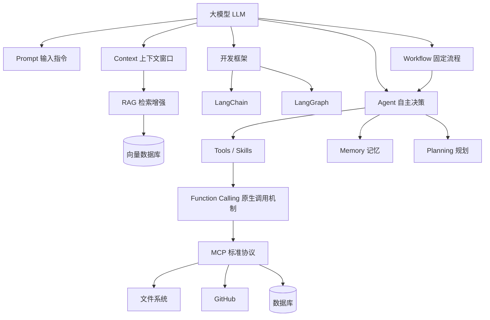

# 大模型演化中的核心概念全景图

> 从 Prompt 到 MCP —— 梳理大模型生态里每个核心概念的来龙去脉、关系与未来。

---

## 概念速览

| 概念 | 出现时期 | 一句话定义 |
|------|---------|-----------|
| Prompt | 2020~ | 给模型的输入指令 |
| Context | 2020~ | 模型能"看到"的所有信息窗口 |
| RAG | 2020~ | 检索增强生成，给模型外挂知识库 |
| LangChain | 2022~ | 串联 LLM 调用的开发框架 |
| Workflow | 2022~ | 固定步骤编排的自动化流程 |
| Agent | 2023~ | 能自主决策、调用工具的 LLM |
| Skills / Tools | 2023~ | Agent 可调用的能力单元 |
| Function Calling | 2023~ | 让模型结构化输出、触发函数调用的原生能力 |
| MCP | 2024~ | 标准化 Agent 与工具连接的协议 |

---

## 一、Prompt（提示词）

### 是什么

Prompt 是你给大模型的"输入"。模型不能主动思考，它只能响应输入 —— Prompt 就是触发它的钥匙。

### 演化路径

- **Zero-shot Prompt**：直接问问题，不给例子
- **Few-shot Prompt**：给几个示例让模型类比
- **Chain-of-Thought (CoT)**：让模型"一步步思考"，提升推理质量
- **System Prompt**：预设模型的角色、规则、限制（OpenAI API 的 system 字段）
- **Prompt Engineering**：系统性优化 Prompt 的工程方法

### 使用场景

```
你是一个专业的客服，只回答关于退款的问题，用简洁的中文回答，不超过50字。
用户问：我的订单什么时候能退款？
```

### 局限

Prompt 本质上是**静态的** —— 你写死了，模型就按那个走。它不能动态扩展知识，也不能调用外部系统。这个局限催生了后续所有概念。

---

## 二、Context（上下文窗口）

### 是什么

Context 是模型在一次推理时能"看到"的**全部内容**，包括：

- System Prompt
- 历史对话记录
- 用户当前输入
- 检索回来的文档片段
- 工具调用的结果

用 Token 来计量（GPT-4 早期 8K → 后来 128K → Claude 3 达到 200K → Gemini 1.5 Pro 100万 Token）。

### 核心矛盾

> **Context 有限 vs 知识无限**

一本书几十万字，放不进 128K Token 的窗口。这个矛盾催生了 RAG。

### 演化趋势

Context 窗口越来越大。有人认为"无限 Context"会取代 RAG，但目前：

- 大 Context 推理慢、成本高
- RAG 可以精准检索，效率更高
- 两者目前是**互补**关系

---

## 三、RAG（检索增强生成）

### 是什么

RAG = **R**etrieval-**A**ugmented **G**eneration

流程：

```
用户提问 → 向量检索知识库 → 取回相关片段 → 塞入 Context → 模型生成回答
```

### 为什么需要 RAG

- 模型训练数据有截止日期（知识过时）
- 企业私有数据模型不知道
- Context 装不下所有文档

### 典型使用场景

1. **企业知识库问答**：上传公司内部文档，员工直接问 AI
2. **法律/医疗查询**：检索法规条文后再回答，减少幻觉
3. **个人 Second Brain**：把笔记、书摘向量化，随时召回

### RAG 的组成

- **Embedding 模型**：把文本转成向量
- **向量数据库**：存储和检索向量（Pinecone、Chroma、Weaviate）
- **检索策略**：相似度搜索、关键词混合搜索、重排序（Rerank）

### 未来走向

随着 Context 窗口越来越大，**简单 RAG 会逐步被大 Context 替代**，但复杂的多跳推理 RAG、Graph RAG 仍有不可替代的价值。

---

## 四、LangChain（框架）

### 是什么

LangChain 是 2022 年出现的 Python/JS 框架，用于把 LLM 调用、工具调用、Memory、检索等"链"起来。

### 它解决了什么问题

在 LangChain 出现前，开发者要手写：
- API 调用封装
- Prompt 模板管理
- 多步骤串联逻辑
- 工具调用逻辑

LangChain 提供了标准化抽象，大幅降低了 LLM 应用开发门槛。

### 核心组件

- **Chain**：把多个步骤串联（问题 → 检索 → 回答）
- **Memory**：跨轮对话记忆
- **Agent**：让 LLM 自主决定调用哪个工具
- **Tool**：工具封装（搜索、计算、数据库查询）

### 使用场景

```python
# 一个简单的 RAG Chain
chain = RetrievalQA.from_chain_type(
    llm=ChatOpenAI(),
    retriever=vectorstore.as_retriever()
)
chain.run("公司的退款政策是什么？")
```

### 现状与走向

LangChain 曾是最流行的 LLM 框架，但随着：
- OpenAI 原生 Function Calling 出现
- 更轻量的框架涌现（LlamaIndex、DSPy）
- MCP 出现后工具调用被标准化

**LangChain 的部分功能正被原生能力或标准协议替代**。官方也在把重心转向 LangGraph（有状态 Agent 图），而不是原来的"链"。

---

## 五、Workflow（工作流）

### 是什么

Workflow 是"**固定步骤编排**"的 LLM 应用形态。人类预先定义好流程图，LLM 在节点上执行任务，整体走向是确定的。

### 和 Agent 的本质区别

|  | Workflow | Agent |
|--|---------|-------|
| 流程控制 | 人类定义好 | LLM 自主决定 |
| 灵活性 | 低 | 高 |
| 可预测性 | 高 | 低 |
| 适合场景 | 标准化业务流程 | 复杂开放任务 |

### 典型工具

- **n8n**：开源工作流自动化
- **Dify**：国内流行的 LLM 工作流平台
- **Coze**：字节跳动出品，面向普通用户
- **Make (Integromat)**：no-code 自动化

### 使用场景

```
触发：收到客户邮件
→ LLM 分类：投诉 / 咨询 / 退款
→ 如果是退款 → 查询订单系统 → 生成退款确认邮件 → 发送
→ 如果是投诉 → 转人工客服
```

### 未来

Workflow + Agent 正在融合 —— 外层 Workflow 保证可靠性，内层节点用 Agent 处理模糊判断。

---

## 六、Agent（智能体）

### 是什么

Agent 是"**能自主决策、循环行动**"的 LLM 应用。

核心循环（ReAct 模式）：

```
思考（Thought）→ 行动（Action，调用工具）→ 观察结果（Observation）→ 再思考...
```

### Agent 的组成

- **LLM 大脑**：决策中枢
- **Tools/Skills**：可调用的能力
- **Memory**：短期（对话历史）+ 长期（持久化记忆）
- **Planning**：任务分解能力

### 使用场景

```
用户：帮我调研 2026 年 AI Agent 市场规模，写一份报告

Agent 自主执行：
  1. 搜索相关资料（调用搜索工具）
  2. 汇总关键数据（调用分析工具）
  3. 生成报告（写作）
  4. 保存文件（调用文件系统工具）
```

### Multi-Agent（多智能体）

多个 Agent 分工协作：
- **Orchestrator Agent**：规划者，拆解任务
- **Worker Agent**：执行者，各自负责子任务
- **Critic Agent**：评审者，检查质量

### 典型框架

- AutoGPT（早期探索）
- CrewAI（多 Agent 协作）
- LangGraph（有状态 Agent 图）
- OpenAI Agents SDK
- **OpenClaw**（个人 AI 助理 Agent）

---

## 七、Skills / Tools（技能 / 工具）

### 是什么

Skills 或 Tools 是 Agent 可以调用的"手"。没有工具，Agent 只能说话，不能做事。

### 常见工具类型

- **信息获取**：网页搜索、数据库查询、文件读取、API 调用
- **计算执行**：代码解释器、数学计算
- **系统操作**：发邮件、创建日历、写文件
- **感知**：截图、摄像头
- **跨 Agent**：调用其他 Agent

### Skills vs Tools 的细微区别

两个词常混用，但：
- **Tool**：通常指单个原子能力（搜索、写文件）
- **Skill**：更偏向"封装好的能力包"，包含调用方式、注意事项、示例

OpenClaw 用 `SKILL.md` 来描述一个技能，是一个很实用的范式。

---

## 八、Function Calling（函数调用）

### 是什么

Function Calling 是 OpenAI 于 2023 年中推出的原生能力：让模型不只返回文字，而是**结构化地输出"要调用哪个函数、传什么参数"**，由开发者代码真正执行，再把结果回传给模型。

这是 Agent 能调用工具的底层机制之一。

### 和普通 Prompt 的区别

普通对话：
```
用户：北京今天天气怎么样？
模型：我不知道，我没有实时数据。
```

加了 Function Calling：
```
用户：北京今天天气怎么样？
模型：{ "function": "get_weather", "args": { "city": "北京" } }
→ 代码执行 get_weather("北京") → 返回 {"temp": "12°C", "weather": "晴"}
→ 模型：北京今天晴，12°C，适合出门。
```

### 工作流程

```
1. 开发者定义函数列表（名称、描述、参数 schema）
2. 用户提问
3. 模型判断是否需要调用函数，输出结构化 JSON
4. 开发者代码执行实际函数
5. 把结果返回给模型
6. 模型结合结果生成最终回答
```

### 使用场景

- **实时信息查询**：天气、股价、快递状态
- **数据库操作**：查订单、改状态
- **第三方 API 集成**：发邮件、创建日历事件
- **多步骤 Agent**：模型自主决定调用哪些工具、用什么参数

### 代码示例（OpenAI Python SDK）

```python
tools = [{
    "type": "function",
    "function": {
        "name": "get_weather",
        "description": "获取指定城市的实时天气",
        "parameters": {
            "type": "object",
            "properties": {
                "city": {"type": "string", "description": "城市名"}
            },
            "required": ["city"]
        }
    }
}]

response = client.chat.completions.create(
    model="gpt-4o",
    messages=[{"role": "user", "content": "北京今天天气怎么样？"}],
    tools=tools,
    tool_choice="auto"  # 让模型自行决定是否调用
)
```

### Function Calling vs MCP vs LangChain Tools

| | Function Calling | LangChain Tools | MCP |
|--|----------------|----------------|-----|
| 层级 | 模型原生能力 | 框架封装 | 跨客户端标准协议 |
| 定义方式 | JSON Schema | Python 类 | MCP Server |
| 适合场景 | 单应用内调用 | LangChain 生态 | 跨 AI 客户端共享工具 |
| 可移植性 | 低（绑定 OpenAI） | 中（绑定框架） | 高（任何 MCP 客户端） |

**关系**：Function Calling 是底层原语，LangChain Tools 对它做了封装，MCP 则是在更高层把"工具提供方"标准化，让多个 AI 客户端都能调用同一套工具。

### 未来走向

Function Calling 会成为所有 LLM 的标配能力（已经是了），而 MCP 在此基础上解决了"工具如何跨客户端共享"的问题。两者是**不同层次的概念，相互补充**，不会互相替代。

---

## 九、MCP（模型上下文协议）

### 是什么

MCP = **M**odel **C**ontext **P**rotocol，由 Anthropic 于 2024 年底推出的开放标准。

> **核心思想**：用统一协议描述"工具/资源/提示"，让任何 LLM 客户端都能标准化地调用任何工具服务。

### 解决了什么问题

在 MCP 之前：
- 每个框架（LangChain、AutoGPT、OpenAI）有自己的工具接口格式
- 工具要为每个框架单独适配
- 生态碎片化

MCP 相当于给 AI 工具世界建立了 **"USB 接口标准"**。

### 架构

```
MCP Client（Claude Desktop / 任何 AI 应用）
    ↕ MCP Protocol（JSON-RPC over stdio/HTTP）
MCP Server（工具提供方：文件系统、数据库、GitHub、Slack...）
```

### 使用场景

```
Claude Desktop 通过 MCP 连接：
- 本地文件系统 MCP Server → 读写文件
- GitHub MCP Server → 查看 PR、创建 Issue
- Slack MCP Server → 发消息

所有这些，Claude 用同一种标准方式调用。
```

### 现状

2025 年 MCP 生态爆发，OpenAI、Cursor、VS Code Copilot 等主流 AI 工具都在接入。这是目前**最重要的标准化趋势**。

---

## 概念关系图



---

## 概念替代关系预测

| 被替代/演变的概念 | 替代它的趋势 | 时间线 | 备注 |
|----------------|------------|--------|------|
| 手写 Prompt 调优 | 自动 Prompt 优化 / DSPy | 3~5 年 | Prompt Engineering 仍是核心技能 |
| 简单 RAG | 大 Context 窗口 | 2~3 年 | 复杂多跳 RAG 仍有价值 |
| LangChain 繁重封装 | 原生 Function Calling + MCP | 已在发生 | LangChain 转向 LangGraph |
| LangChain Tool 封装 | Function Calling 原生 + MCP | 已在发生 | 轻量场景直接用原生即可 |
| 各框架各自的 Tool 接口 | MCP 标准协议 | 1~2 年 | 强烈趋势 |
| 单一 Agent | Multi-Agent 协作 | 3~5 年 | 复杂任务天然需要分工 |
| Workflow 和 Agent 各自为政 | 融合架构 | 2~3 年 | Dify 等已在融合 |

---

## 一句话总结整个演化逻辑

```
提问 → 回答                    （Prompt）
提问 + 记忆 → 更好的回答        （Context）
提问 + 知识库 → 更准确的回答    （RAG）
串联多步骤 → 完成复杂任务        （LangChain / Workflow）
给模型手脚 → 能自己干活         （Agent + Tools/Skills）
统一手脚接口 → 生态互通          （MCP）
```

**本质上，这是一条"让 AI 从回答问题 → 完成任务 → 自主工作"的演化路径。**

---

*Last updated: 2026-02-28 | by Dream 🌙*
