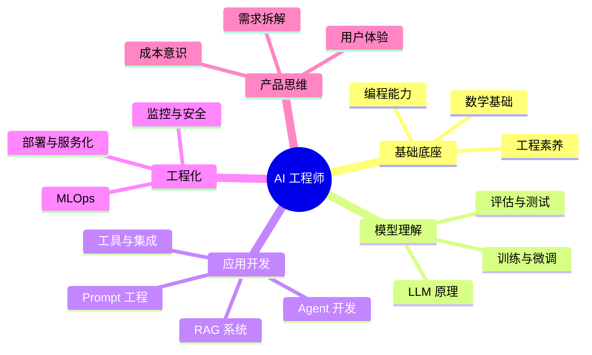

# AI 开发工程师 / AI 专家能力图谱

> 想成为一个真正能做事的 AI 工程师，需要什么？这里是一份诚实的清单。

---

## 总览：能力地图



---

## 第一层：基础底座

这是地基，没有它，上面的一切都是空中楼阁。

### 1.1 编程能力

| 技能 | 说明 | 优先级 |
|------|------|--------|
| **Python** | AI 开发的第一语言，必须熟练 | ⭐⭐⭐ 必须 |
| 异步编程（async/await） | 调 API、处理流式输出都需要 | ⭐⭐⭐ |
| JavaScript / TypeScript | 前端集成、Node.js 服务、很多 AI 工具是 JS 生态 | ⭐⭐ 重要 |
| Git & 版本控制 | 基本工程素养 | ⭐⭐⭐ 必须 |
| HTTP / REST / WebSocket | 调 API、流式输出、理解通信协议 | ⭐⭐⭐ |
| Docker & 容器化 | 部署模型和服务的基础 | ⭐⭐ |

### 1.2 数学基础

不需要推导公式，但要理解概念：

- **线性代数**：向量、矩阵乘法（Embedding 的本质）
- **概率统计**：理解模型输出的概率分布、temperature 的作用
- **微积分基础**：理解梯度下降（微调时需要）

> **实用主义建议**：3Blue1Brown 的《线性代数的本质》和《神经网络》系列，够用了。

### 1.3 工程素养

- 读懂 API 文档，快速上手新工具
- 会写测试，知道怎么验证 AI 输出质量
- 理解成本（Token 计费、API 调用次数）
- 能写清晰的注释和文档

---

## 第二层：模型理解

你不需要自己训练大模型，但你需要理解它是怎么工作的。

### 2.1 LLM 基础原理

- **Transformer 架构**：理解 Attention 机制的直觉（不需要手推）
- **Token 化**：什么是 Token，为什么中文 Token 比英文贵
- **Context Window**：为什么有限制，如何高效利用
- **Temperature & Top-P**：控制输出的随机性
- **Embedding**：把文字变成向量意味着什么

### 2.2 主流模型认知

要知道当前主要玩家：

| 公司 | 模型 | 特点 |
|------|------|------|
| OpenAI | GPT-4o, o1, o3 | 综合最强，生态最广 |
| Anthropic | Claude 3.5/3.7 | 长 Context，推理强，安全性高 |
| Google | Gemini 1.5/2.0 | 超长 Context，多模态强 |
| Meta | Llama 3 | 开源，可本地部署 |
| 阿里 | Qwen 2.5 | 中文最强开源，代码能力强 |
| DeepSeek | R1, V3 | 推理强，成本低 |

### 2.3 微调（Fine-tuning）基础

- 什么时候需要微调 vs RAG vs Prompt（三者怎么选）
- **LoRA / QLoRA**：低成本微调方法，概念要懂
- 数据准备：格式（JSONL）、数量、质量比数量更重要
- 常用平台：OpenAI Fine-tuning API、Hugging Face + PEFT

### 2.4 多模态

- 图像理解（Vision）：GPT-4V、Claude Vision
- 语音（STT/TTS）：Whisper、OpenAI TTS
- 未来趋势：文本/图像/音频/视频统一处理

---

## 第三层：应用开发（核心战场）

这是 AI 工程师最花时间的地方。

### 3.1 Prompt 工程

- System Prompt 设计：角色、边界、格式要求
- Few-shot 示例构造
- Chain-of-Thought 技巧
- 结构化输出（JSON mode、XML 标签）
- Prompt 版本管理（别用注释乱放，要有系统）

**工具**：PromptLayer、LangSmith（追踪和评估 Prompt）

### 3.2 RAG 系统开发

这是目前企业 AI 应用最常见的形态，必须会。

**核心流程**：
```
文档处理 → 切块（Chunking）→ Embedding → 存向量库 → 检索 → 注入 Context → 生成
```

**关键技能**：
- 文档解析（PDF、Word、网页）
- 切块策略（固定大小 vs 语义切块）
- Embedding 模型选型（OpenAI、BGE、nomic-embed）
- 向量数据库（Chroma 本地开发、Pinecone/Weaviate 生产）
- 检索优化：混合检索、重排序（Rerank）、HyDE
- 评估 RAG 质量（RAGAS 框架）

### 3.3 Agent 开发

- ReAct 模式实现
- Tool / Function Calling 定义与调用
- Memory 管理（短期对话历史 + 长期持久化）
- 错误处理和重试逻辑（模型会出错！）
- Multi-Agent 协作（CrewAI、LangGraph、OpenAI Swarm）

### 3.4 主流框架

| 框架 | 适用场景 | 学习优先级 |
|------|---------|----------|
| OpenAI SDK | 直接调 API，最简单 | ⭐⭐⭐ 必须 |
| LangChain | 复杂链和 RAG | ⭐⭐ |
| LangGraph | 有状态 Agent、工作流 | ⭐⭐ |
| LlamaIndex | RAG 专精框架 | ⭐⭐ |
| CrewAI | 多 Agent 协作 | ⭐ 进阶 |
| Dify / Coze | 低代码 AI 应用 | ⭐⭐ 快速验证 |

### 3.5 MCP 与工具集成

- 理解 MCP 协议，能搭建 MCP Server
- 常用 MCP Server：文件系统、数据库、GitHub、Slack
- 在支持 MCP 的客户端（Claude Desktop、Cursor）中调试

---

## 第四层：工程化能力

能做出来 ≠ 能用于生产。

### 4.1 部署与服务化

- **API 服务**：FastAPI / Flask 封装 LLM 调用
- **流式输出**（Streaming）：Server-Sent Events，让用户看到逐字输出
- **本地模型部署**：Ollama、vLLM、llama.cpp
- **云端部署**：AWS Bedrock、Azure OpenAI、阿里云百炼

### 4.2 性能与成本优化

- Token 用量监控，避免超支
- 缓存策略（Prompt Cache、语义缓存）
- 批处理（Batch API）
- 模型选型：大模型用于复杂任务，小模型处理简单任务，省钱

### 4.3 可观测性（Observability）

生产环境必须有监控：
- **LangSmith**：追踪每次 LLM 调用、Prompt、输出、延迟
- **Langfuse**：开源替代，支持自部署
- 关键指标：延迟（P50/P99）、Token 用量、错误率、用户满意度

### 4.4 安全与合规

- **Prompt Injection**：用户试图绕过系统指令
- **输出过滤**：防止有害内容、个人信息泄露
- **数据隐私**：用户数据是否发给第三方 API？
- **幻觉处理**：引导模型说"不知道"而不是编造

---

## 第五层：产品与领域思维

技术之外，让你从工程师变成专家的东西。

### 5.1 产品感

- 能拆解用户需求，判断"用 AI 做这个值不值"
- 理解 AI 的边界：什么能做，什么容易翻车
- 快速原型验证（Dify/Coze 先跑通再工程化）
- 知道什么时候**不用** AI（别为了 AI 而 AI）

### 5.2 评估能力

AI 应用最难的不是做出来，是**验证它好不好用**：

- 构建评估集（evals）
- 自动化评估（LLM-as-judge）
- A/B 测试不同 Prompt / 模型
- 人工标注与质量审核

### 5.3 持续学习能力

这个领域三个月一个大变化，能跟上才是核心竞争力：

- 关注：Andrej Karpathy、Simon Willison、LangChain 博客、Hugging Face 论文速读
- 动手：看到新技术先跑一遍，比看十篇文章强
- 社区：Discord（LangChain、OpenAI）、Reddit r/LocalLLaMA、Twitter/X AI 圈

---

## 学习路径建议

### 🟢 入门（0 → 3 个月）

1. Python 基础（如果还不会）
2. OpenAI API 调用，理解 Prompt / Context / Token
3. 做一个简单 RAG：PDF → 向量库 → 问答
4. 理解 Function Calling，调一个真实 API（天气/搜索）
5. 用 Dify 或 Coze 做一个完整应用，体验工作流

**目标**：能独立做出一个可用的 AI 应用

### 🟡 进阶（3 → 12 个月）

1. 深入 RAG：评估、优化检索质量、生产化
2. Agent 开发：LangGraph 有状态 Agent，处理复杂任务
3. 微调入门：LoRA 微调一个小模型
4. 部署：FastAPI + Docker + 云部署，跑一个真实服务
5. 可观测性：LangSmith 接入，开始监控生产质量

**目标**：能把 AI 应用从 demo 推向生产

### 🔴 专家（1 年以上）

1. 深入某个垂直领域（代码生成、法律、医疗、金融）
2. Multi-Agent 系统设计
3. 大规模 RAG 系统（百万文档级别）
4. 模型评估体系建设
5. AI 安全与对齐实践
6. 跟进前沿：读论文，理解 o1/o3 这类推理模型的原理

**目标**：能设计系统、培养团队、判断技术方向

---

## 工具箱速查

### 开发常用

| 类型 | 工具 |
|------|------|
| LLM API | OpenAI、Anthropic、阿里云百炼、DeepSeek |
| 本地模型 | Ollama、LM Studio |
| RAG 框架 | LlamaIndex、LangChain |
| 向量库 | Chroma（本地）、Pinecone（云端）|
| Agent 框架 | LangGraph、CrewAI、OpenAI Agents SDK |
| 低代码 | Dify、Coze、n8n |
| 监控 | LangSmith、Langfuse |
| 评估 | RAGAS、DeepEval |

### 学习资源

| 资源 | 说明 |
|------|------|
| [fast.ai](https://fast.ai) | 最好的实践派深度学习课程 |
| [Andrej Karpathy YouTube](https://youtube.com/@AndrejKarpathy) | 从零理解 LLM |
| [deeplearning.ai 短课程](https://learn.deeplearning.ai) | LangChain/RAG/Agent 系列，免费 |
| Hugging Face 文档 | Transformers、PEFT、数据集 |
| [Simon Willison's Blog](https://simonwillison.net) | AI 工具实战，更新最快 |
| [learnprompting.org](https://learnprompting.org) | Prompt Engineering 系统学习 |

---

## 一句话总结

> AI 工程师 = **扎实的工程基础** × **对 LLM 的直觉理解** × **快速构建和验证的能力**  
> AI 专家在此基础上加上：**领域深度** + **系统设计能力** + **持续跟进前沿**

技术在变，但"快速学习、动手验证、以终为始"这三点永远不过时。

---

*Last updated: 2026-02-28 | by Dream 🌙*
