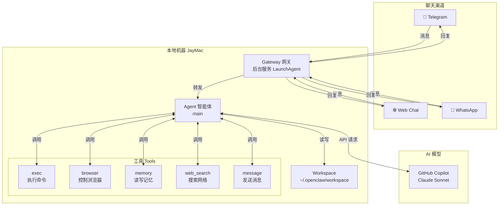
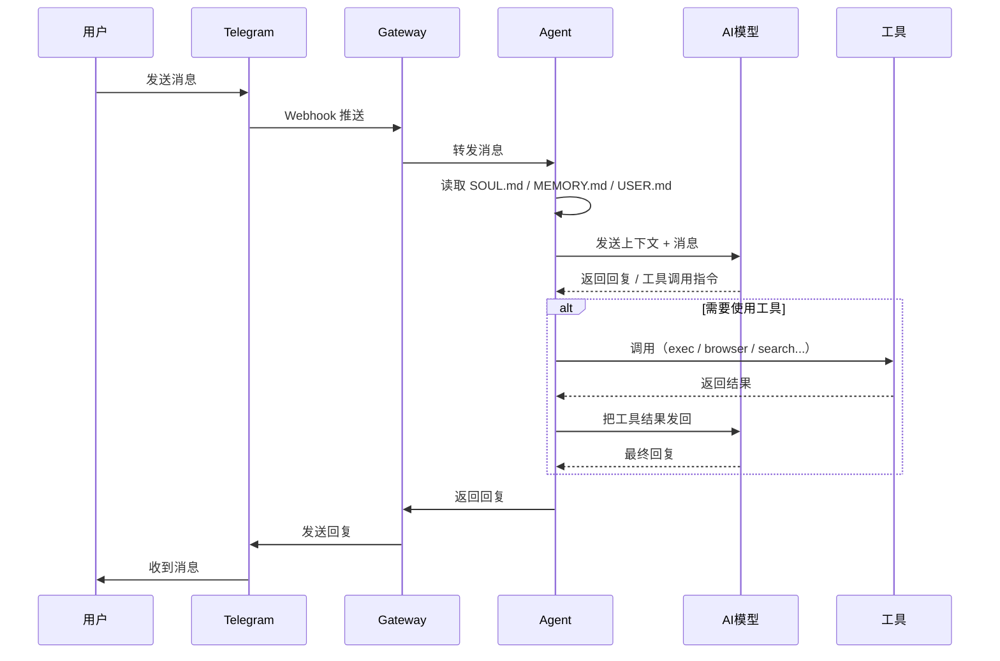
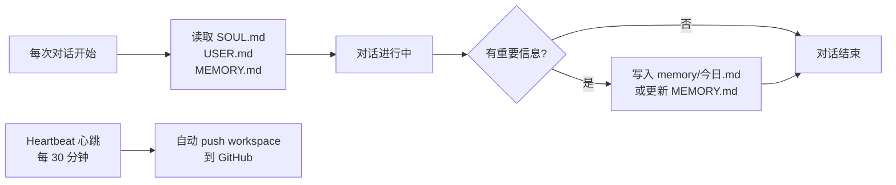

# OpenClaw 工作原理

> OpenClaw 是一个运行在本地的 AI 助手框架，把 AI 模型、聊天渠道、工具能力整合在一起。

---

## 整体架构

---

## 一条消息的完整旅程

---

## 核心组件说明

### 🔌 Gateway（网关）
- OpenClaw 的核心服务，以 **LaunchAgent** 形式在后台运行
- 负责连接所有聊天渠道（Telegram、WhatsApp 等）
- 接收消息 → 转发给 Agent → 把回复发回渠道
- 电脑重启自动启动，关闭终端不影响运行

### 🤖 Agent（智能体）
- 真正"思考"的部分，调用 AI 模型生成回复
- 每次对话都会先读取记忆文件，保持连续性
- 可以调用各种工具来完成任务

### 🧠 AI 模型
- 目前使用：**GitHub Copilot / Claude Sonnet 4.6**
- Agent 把对话上下文发给模型，模型返回回复或工具调用指令
- 上下文窗口：128k token（约 10 万字）

### 📁 Workspace
- 存放所有记忆、笔记、配置文件
- `MEMORY.md` — 长期记忆
- `SOUL.md` — AI 助手的性格设定
- `USER.md` — 用户信息
- `memory/YYYY-MM-DD.md` — 每日日志

### 🛠 Tools（工具）
| 工具 | 能做什么 |
|------|---------|
| `exec` | 执行终端命令（打开 App、运行脚本等） |
| `browser` | 控制浏览器，截图、点击、填表 |
| `memory` | 读写记忆文件 |
| `web_search` | 搜索网络 |
| `message` | 主动发送消息给用户 |
| `canvas` | 展示可视化内容 |
| `nodes` | 控制配对设备 |

---

## 记忆机制

- **短期记忆**：当前对话的上下文（128k token 窗口内）
- **长期记忆**：`MEMORY.md` 文件，跨会话持久保存
- **每日日志**：`memory/YYYY-MM-DD.md`，原始记录

---

## 多渠道 & 多设备

```mermaid
graph TB
    subgraph 你的设备
        Mac[💻 MacBook\nGateway 运行中]
        Mini[🖥 Mac mini\n同步 workspace]
    end

    subgraph 聊天渠道
        W[🌐 Web Chat]
        T[💬 Telegram\n@jay_openClawbot]
    end

    subgraph GitHub
        Repo[🔒 openclaw-workspace\n私有仓库]
    end

    W <-->|本地| Mac
    T <-->|Webhook| Mac
    Mac <-->|auto push / manual pull| Repo
    Mini <-->|manual pull / push| Repo
```

- 同一个 AI 助手，多个渠道都能用
- 两台电脑通过 GitHub 私有仓库同步数据
- Mac mini 切换前手动 `git pull`，AI 助手定期自动 `git push`
