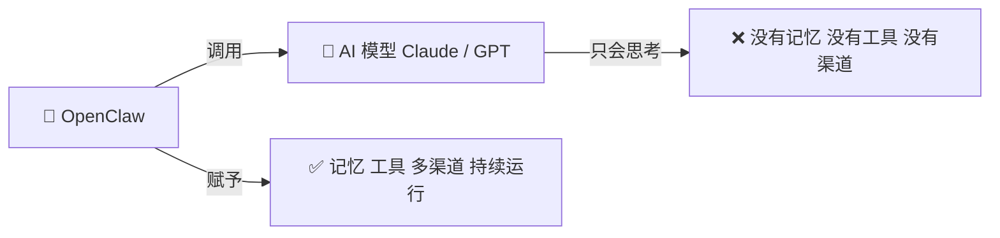
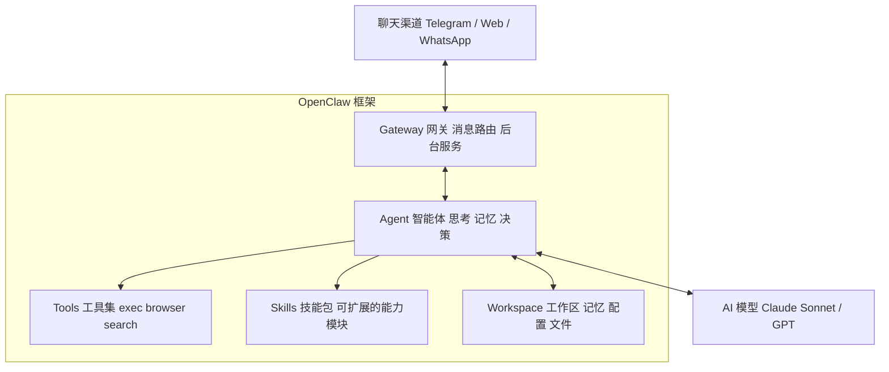

# OpenClaw 是什么？

> OpenClaw 不只是一个聊天机器人，也不只是一个 AI 模型的封装。它是一个**本地运行的 AI Agent 框架**。

---

## OpenClaw 的角色定位

简单说：**AI 模型只负责思考，OpenClaw 负责让它活起来。**

---

## 什么是 Agent？

Agent（智能体）= **能感知环境、做决策、采取行动** 的 AI 系统。

普通聊天 AI（如 ChatGPT 网页版）：
- 你问 → 它答 → 结束
- 没有记忆，没有工具，不能主动做事

OpenClaw Agent：
- 有**记忆**（跨会话记住你是谁、你的偏好）
- 有**工具**（能执行命令、搜索网络、控制浏览器）
- 能**主动行动**（心跳检查、定时任务、主动发消息）
- 能**持续运行**（后台服务，24 小时在线）

---

## OpenClaw 的层次结构

| 层次 | 角色 | 职责 |
|------|------|------|
| **AI 模型** | 大脑 | 理解语言、生成回复、决定用哪个工具 |
| **Agent** | 灵魂 | 维持记忆、调度工具、执行任务 |
| **Gateway** | 神经系统 | 连接各渠道，路由消息 |
| **Tools** | 手脚 | 实际执行操作（命令、搜索、浏览器...） |
| **Skills** | 技能书 | 可插拔的能力扩展包 |
| **Workspace** | 记忆宫殿 | 存储一切持久化数据 |

---

## 和普通 AI 助手的区别

| | ChatGPT / Claude 网页版 | OpenClaw Agent |
|---|---|---|
| 运行位置 | 云端 | **本地** |
| 记忆 | 单次对话 | **跨会话持久记忆** |
| 工具 | 有限（插件） | **可自定义扩展** |
| 渠道 | 只有网页 | **Telegram、WhatsApp 等** |
| 主动性 | 被动回答 | **可主动发消息、定时任务** |
| 数据隐私 | 在云端 | **数据在你本地** |
| 可扩展性 | 不可控 | **完全开放，自由定制** |

---

## 一句话总结

> OpenClaw = **AI 模型的躯体**。
> 模型提供智慧，OpenClaw 提供记忆、工具、感知和行动能力，让 AI 真正成为你的私人助手。
