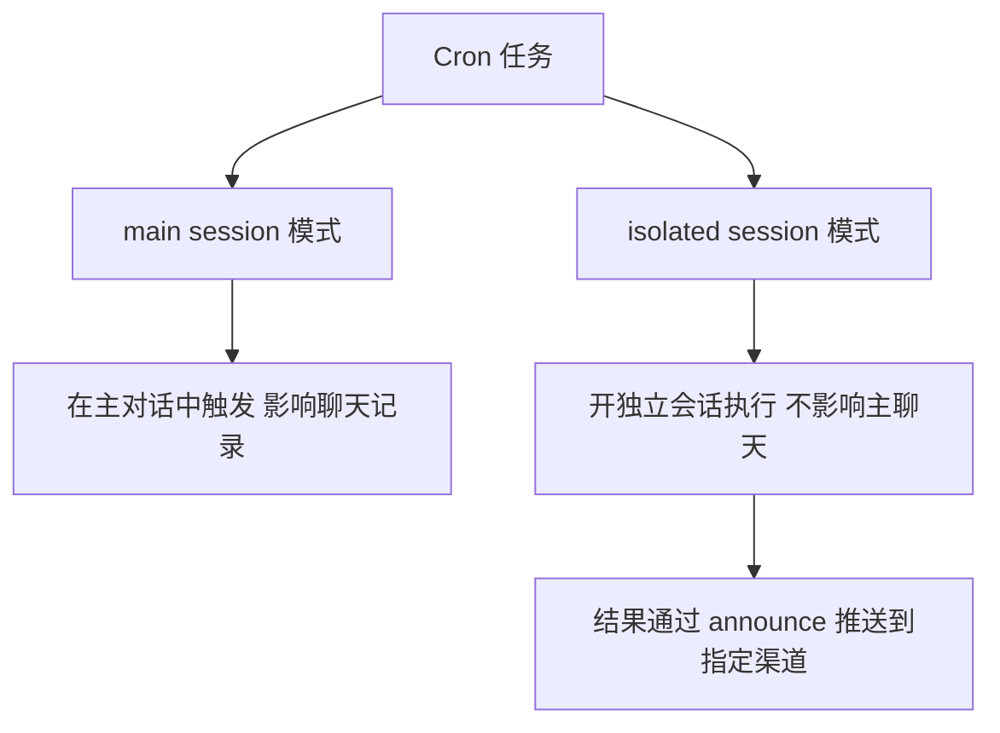
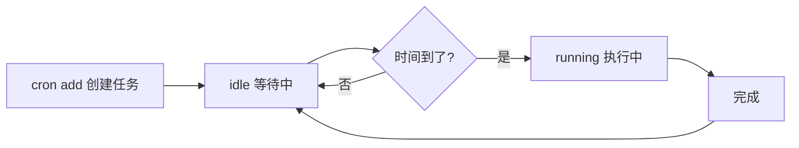

# A股日报系统

> 基于 OpenClaw Cron 定时任务，每个交易日自动抓取财经数据，生成早报/收盘复盘/晚报，发送到 Telegram。

---

## 系统架构


**数据来源：**
- 东方财富 https://www.eastmoney.com
- 同花顺 https://www.10jqka.com.cn
- 开盘啦 https://kaipanla.com
- 雪球 https://xueqiu.com

**发送渠道：** Telegram @jay_openClawbot（后续可切换飞书）

---

## 日报时间表

| 报告 | 发送时间 | 周期 |
|------|---------|------|
| 📊 早报 | 每个交易日 08:30 | 周一至周五 |
| 📈 收盘复盘 | 每个交易日 15:30 | 周一至周五 |
| 🌙 晚报 | 每个交易日 21:30 | 周一至周五 |

---

## 日报内容

### 📊 早报（08:30）

```
【A股早报 YYYY-MM-DD】
① 隔夜外盘情况及对A股影响预判
② 市场情绪预判（昨日涨跌比、成交量、北向资金）
③ 主流热点板块 Top3（板块名+驱动逻辑+持续性评估⭐）
④ 重点关注个股（股票名+代码+上涨性质+风险提示）
⑤ 今日操作建议（短线方向+需回避风险点）
```

### 📈 收盘复盘（15:30）

```
【A股收盘复盘 YYYY-MM-DD】
① 今日市场总结（指数涨跌、成交量、情绪评分1-10）
② 热点板块复盘（涨幅最大板块+驱动因素+明日持续性⭐）
③ 个股亮点（涨幅居前个股+性质：情绪炒作/基本面驱动）
④ 资金动向（主力资金、北向资金）
⑤ 明日预判（值得关注方向+潜在风险）
```

### 🌙 晚报（21:30）

```
【A股晚报 YYYY-MM-DD】
① 今日市场回顾（一句话总结）
② 盘后重要消息（政策面、消息面、行业动态）
③ 明日重点关注（影响明日行情的事件/数据）
④ 热点板块前瞻（明日最值得关注1-2个板块+理由）
⑤ 短线选股方向（结合量能和资金流向）
⑥ 风险提示
```

---

## 搭建步骤

### 1. 确认 OpenClaw 已安装并运行

```bash
openclaw status
```

确保 Gateway 状态为 running，Telegram 渠道状态为 OK。

### 2. 添加早报 Cron 任务

```bash
openclaw cron add \
  --name "A股早报" \
  --cron "30 8 * * 1-5" \
  --tz "Asia/Shanghai" \
  --session isolated \
  --message "请帮我生成今日A股早报..." \
  --announce \
  --channel telegram
```

### 3. 添加收盘复盘 Cron 任务

```bash
openclaw cron add \
  --name "A股收盘复盘" \
  --cron "30 15 * * 1-5" \
  --tz "Asia/Shanghai" \
  --session isolated \
  --message "请帮我生成今日A股收盘复盘报告..." \
  --announce \
  --channel telegram
```

### 4. 添加晚报 Cron 任务

```bash
openclaw cron add \
  --name "A股晚报" \
  --cron "30 21 * * 1-5" \
  --tz "Asia/Shanghai" \
  --session isolated \
  --message "请帮我生成今晚A股晚报..." \
  --announce \
  --channel telegram
```

### 5. 确认任务已创建

```bash
openclaw cron list
```

输出示例：
```
ID        Name       Schedule                    Next    Status
xxxxxx    A股早报     cron 30 8 * * 1-5 @ Asia..  in 9h   idle
xxxxxx    A股收盘复盘  cron 30 15 * * 1-5 @ Asia.. in 16h  idle
xxxxxx    A股晚报     cron 30 21 * * 1-5 @ Asia.. in 22h  idle
```

---

## 常用管理命令

```bash
# 查看所有 cron 任务
openclaw cron list

# 立即手动触发（测试用）
openclaw cron run <job-id>

# 暂停某个任务
openclaw cron disable <job-id>

# 恢复任务
openclaw cron enable <job-id>

# 删除任务
openclaw cron delete <job-id>

# 查看运行日志
openclaw cron runs --id <job-id>
```

---

## Cron 表达式说明

```
30 8 * * 1-5
│  │ │ │ └── 周一到周五
│  │ │ └──── 每月（不限）
│  │ └────── 每天（不限）
│  └──────── 8点
└─────────── 30分
```

---

## 切换到飞书

飞书配置好后，只需更新每个任务的 channel 参数：

```bash
openclaw cron edit <job-id> --announce --channel feishu
```

---

## Cron 是什么？

### 一句话理解

> **Cron = 定时闹钟**。你设定好"什么时候"做"什么事"，时间到了自动执行，不需要人工干预。

Cron 是 Unix/Linux 系统自带的定时任务机制，历史超过 50 年，是服务器自动化的基础工具。OpenClaw 内置了 Cron 调度器，让 AI 也能按时自动执行任务。

### Cron 表达式

Cron 用一串简洁的表达式描述"什么时候执行"：

```
┌─────────── 分钟 (0-59)
│  ┌──────── 小时 (0-23)
│  │  ┌───── 日期 (1-31)
│  │  │  ┌── 月份 (1-12)
│  │  │  │  ┌─ 星期 (0-7，0和7都是周日)
│  │  │  │  │
30  8  *  *  1-5
```

**常用示例：**

| 表达式 | 含义 |
|--------|------|
| `30 8 * * 1-5` | 每周一至五 08:30 |
| `30 15 * * 1-5` | 每周一至五 15:30 |
| `0 9 * * *` | 每天早上 9:00 |
| `0 */2 * * *` | 每隔 2 小时 |
| `0 9 1 * *` | 每月 1 号早上 9:00 |
| `*/30 * * * *` | 每 30 分钟 |

> 💡 **`*` 表示"任意"**，`1-5` 表示"1到5"，`*/2` 表示"每隔2"。

### OpenClaw Cron 的两种模式



| 模式 | 适合场景 |
|------|---------|
| `main session` | 需要主对话上下文的任务（如提醒） |
| `isolated session` | 独立自动化任务（如日报、定时推送）✅ A股日报用的就是这个 |

### Cron 任务的生命周期



任务持久存储在 `~/.openclaw/cron/jobs.json`，重启 Mac 或 Gateway 后依然有效。

### 常用管理命令

```bash
# 查看所有任务及下次执行时间
openclaw cron list

# 立即手动触发（不等时间，测试用）
openclaw cron run <job-id>

# 暂停 / 恢复
openclaw cron disable <job-id>
openclaw cron enable <job-id>

# 查看某个任务的历史运行记录
openclaw cron runs --id <job-id>

# 删除任务
openclaw cron delete <job-id>
```

---

## 实现原理

### 没有代码，只有配置

日报系统**没有任何单独的代码文件**，全部实现存储在一个 JSON 文件里：

```
~/.openclaw/cron/jobs.json
```

每个任务的核心结构如下：

```json
{
  "id": "6b0dd324-...",
  "name": "A股早报",
  "schedule": {
    "kind": "cron",
    "expr": "30 8 * * 1-5",
    "tz": "Asia/Shanghai"
  },
  "sessionTarget": "isolated",
  "payload": {
    "kind": "agentTurn",
    "message": "请帮我生成今日A股早报..."
  },
  "delivery": {
    "mode": "announce",
    "channel": "telegram"
  }
}
```

### 完整执行流程


### 关键字段说明

| 字段 | 值 | 含义 |
|------|----|------|
| `schedule.expr` | `30 8 * * 1-5` | Cron 表达式：周一至周五 8:30 |
| `sessionTarget` | `isolated` | 开独立会话，不影响主聊天记录 |
| `payload.message` | 提示词文本 | 发给 AI 的指令，告诉它要做什么 |
| `delivery.mode` | `announce` | 把结果主动推送出去 |
| `delivery.channel` | `telegram` | 推送到 Telegram |

### 本质

> **日报系统 = 定时器 + 提示词 + 推送**
>
> Gateway 在指定时间把提示词发给 AI，AI 去抓取网站数据分析后，把结果推送到 Telegram。
> OpenClaw 把这整套流程封装成了一行 `cron add` 命令。

---

## 注意事项

- 数据来源为公开财经网站，适合趋势和热点分析，不适合精确实时价格监控
- Mac 需保持开机状态，Gateway 后台服务会自动触发
- 所有分析仅供参考，不构成投资建议，最终决策由自己判断
- 如需实时行情数据，后续可接入东方财富 API 或 AKShare
